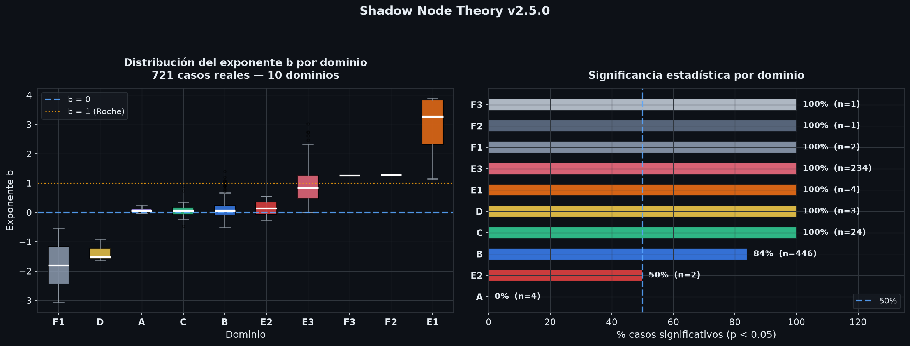
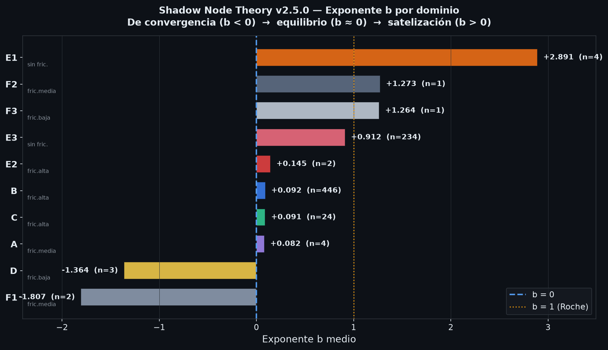
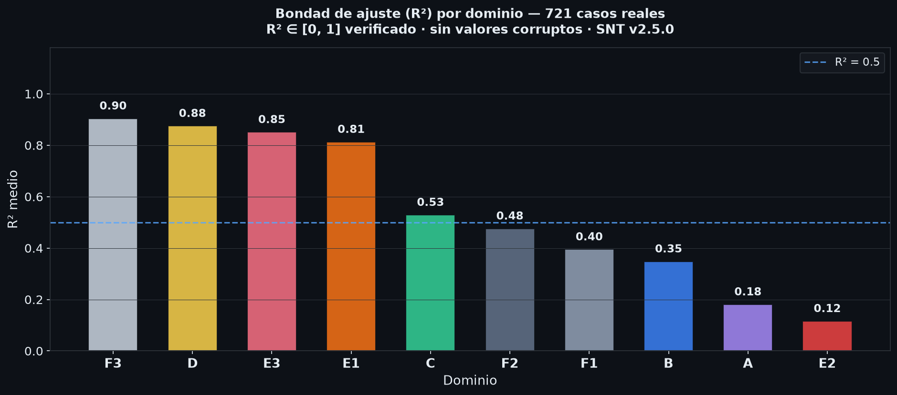

# Shadow Node Theory v2.5.0

**Elan Zainos Corona** | Fractal Core Research, Tlaxcala, Mexico

ORCID: [0009-0009-9125-253X](https://orcid.org/0009-0009-9125-253X)

[](https://ssrn.com/abstract=6418778)
[](https://doi.org/10.5281/zenodo.19446521)
[](https://github.com/Inzainos/The-shadow-Node-Theory)
[](https://github.com/Inzainos/The-shadow-Node-Theory/actions/workflows/python-package-conda.yml)

## Setup

Use Conda to install the project runtime environment:

```bash
conda env create -f environment.yml
conda activate snt-env
```

This installs the runtime dependencies defined in `environment.yml`, including `flake8` for syntax validation.

If you want to install the plain Python requirements inside the activated Conda environment later:

```bash
python -m pip install -r requirements.txt
```

For development, testing and linting tools, use the development environment:

```bash
conda env create -f environment-dev.yml
conda activate snt-dev-env
```

`environment-dev.yml` includes the runtime dependencies plus common dev tools such as `pytest`, `pre-commit`, `black`, `isort`, `mypy`, `ruff`, and `tox`.

For a quick command reference and workflow shortcuts, see `dev-guide.md`.

To update an existing environment from the YAML file:

```bash
conda env update -f environment.yml --prune
```

---

## Continuous Integration

This repository uses GitHub Actions with a Conda-based workflow located at `.github/workflows/python-package-conda.yml`.

The workflow currently:

- checks out the repository
- sets up Miniconda and creates the `snt-env` environment from `environment.yml`
- installs standard Python requirements
- runs `flake8` for syntax and undefined-name checks
- compiles active Python modules
- executes a smoke test with `python reconstruction_real/code/build_aco_v29.py`

Use the badge at the top of this README to view CI status for the default branch.

---

> **WARNING: PREVIOUS VERSION OBSOLETE**
> The 502-case corpus (v2.3.1 and earlier) contained synthetically generated
> values and an r2 column with impossible values (down to -7.332).
> Those files are preserved in `archive/` as historical record but
> **must not be cited in academic publications**.
> The active version is v2.5.0 (721-case corpus + coupled collapse layer).

---

> **NEW in v2.5.0 -- Coupled Orbital Collapse layer (ACO-A)**
> Collapse is reformulated as a **universal, transversal axis** of SNT, with
> evidence in **5 domains** (finance, history, crypto, biology, astronomy) from
> real data. See [Orbital Collapse Architecture (Coupled, v2.5.0)](#orbital-collapse-architecture-coupled-v250)
> below and the full theory in `papers/SNT_Colapso_Acoplado.md`.

---

## What Is Shadow Node Theory?

When two coupled entities interact over time -- a dominant **hub** and a
peripheral **node** -- the dominance ratio evolves in a regular way.
SNT characterizes that evolution through scaling exponents estimated by fitting
power laws on logarithmic axes. Two orthogonal axes describe a system:

- **Satellization (b):** `R(t) = metric_hub(t) / metric_node(t) = a*t^b` --
  how dominance evolves *while the coupled relationship runs*.
- **Collapse (Delta):** `A(tau) = c*tau^Delta` -- how the hub's mass is
  *absorbed once it undergoes functional extinction* (the v2.5.0 layer).

The sign and magnitude of **b** summarize the direction and speed of
**satellization** -- the process by which a peripheral entity loses or gains
relative standing against a dominant core.

```
b < 0    --> convergence (node gains ground)
b ~ 0    --> dynamic equilibrium
0 < b < 1 --> sublinear satellization (gradual)
b >= 1    --> superlinear satellization -- Roche Radius
```

---

## Corpus v2.5.0 -- 721 cases, 100% real data

| Domain | Friction | Cases | Sig. | b mean | Source |
|--------|----------|-------|------|--------|--------|
| A -- Cities | medium | 4 | 0% | +0.08 | UN Demographic Yearbook |
| B -- Countries | high | 446 | 84% | +0.09 | Maddison Project 2020 |
| C -- Regions | high | 24 | 100% | +0.09 | INEGI + US Census |
| D -- Digital | low | 3 | 100% | -1.36 | HackerEarth 2026 |
| E1 -- Invasion | none | 4 | 100% | +2.89 | OWID COVID (spatial) |
| E2 -- Predator-prey | high | 2 | 50% | +0.15 | MacLulich/Elton |
| E3 -- Parasite-host | none | 234 | 100% | +0.91 | JHU COVID-19 |
| F1 -- Planetary | medium | 2 | 100% | -1.81 | Open Exoplanet Cat. |
| F2 -- Stellar | medium | 1 | 100% | +1.27 | Open Exoplanet Cat. |
| F3 -- Multiplanet | low | 1 | 100% | +1.26 | Open Exoplanet Cat. |
| **TOTAL** | | **721** | **89%** | **+0.37** | |

**Integrity verified:** R2 in [0,1] for all cases. Zero corrupt values. All reproducible from public scripts.

---

## Visualizaciones del corpus


*Fig. 1 — Distribución del exponente b por dominio y porcentaje de casos significativos (p < 0.05).*


*Fig. 2 — Exponente b medio por dominio: de convergencia (b < 0) a satelización (b > 0), con fricción institucional anotada.*


*Fig. 3 — R² medio por dominio. R² ∈ [0,1] verificado, cero valores corruptos.*

---

---

## Central Finding

Institutional friction predicts the satellization exponent:

**Spearman rho = -0.68, p = 2.5x10^-97** (social/biological domains, n=714)

Systems without friction (E1, E3): b mean = +0.95
Systems with friction (A, B, C): b mean = +0.09
**Mann-Whitney p = 2.4x10^-74**

---

## Three Core Statistical Findings (v30)

| Finding | Result | Test |
|---------|--------|------|
| Abrupt triggers faster than gradual | Ratio 5.9x in historical corpus | Mann-Whitney U=24,802, p=1.91x10^-5, n=486 |
| Institutional friction is dominant predictor of b | Friction-free: b~+0.95 / High friction: b~+0.09 | Spearman rho=-0.68, p=2.5x10^-97, n=714 |
| Sovereignty = interdependence as brake | Country pairs (B, n=446, b~+0.09) vs predator-prey (E2, b~+0.15) statistically indistinguishable | Regime split MW p=2.4x10^-74 |

---

## Publication Status

| Target | Status | Notes |
|--------|--------|-------|
| **SSRN** (abstract 6418778) | REVISION SUBMITTED | **v30 revision submitted 28 Jun 2026** (`papers/snt_ssrn_v30_EN`); supersedes v2.3.1/502; under SSRN review |
| **Zenodo** (DOI 10.5281/zenodo.19446521) | PUBLISHED | Record updated to v2.5.0 (721-case corpus) |
| **PLOS Complex Systems** (PCSY-D-26-00059) | REVISION SUBMITTED | v30 revision package submitted (`snt_plos_v30` + `plos_response_to_reviewers_v30`); addresses both reviewers; awaiting decision |
| **J. Complex Networks** (COMNET-2026-214) | REJECTED | No external review |
| **MIT GCFP Conference** | SUBMITTED | 13th Annual Conf, Oct 29-30 2026; paper + abstract submitted (`papers/mit_gcfp_2026_*`) |
| J. Theoretical Biology | NOT RELEASED | Requires v30 update |
| Astrophysical Journal | NOT RELEASED | Requires v30 update |
| Investigacion Economica | NOT RELEASED | Requires v30 update |

---

## N-Body Matrix Correction -- Mexican National System

Standard binary models (Tlaxcala vs Puebla) underestimate Tlaxcala's satellization
gradient by 9.3x because 89.2% of extraction flows toward CDMX, not Puebla.
The N-body correction (32 federal entities, INEGI 2022) reveals a power-law
distribution of satellization weights (b=-0.473, R2=0.838, p<0.001) consistent
with preferential attachment predictions. Queretaro (b=-0.155) and Nuevo Leon
(b=-0.058) document the first confirmed leapfrog cases within the national
system.

---

## Módulo XVI -- Arquitectura de Colapso Orbital (ACO)

ACO extends SNT to cases where a hub undergoes **functional extinction** and its
resources are **absorbed by an identifiable node**. Without both elements, the
case is classical SNT satellization, not ACO.

| Domain | Cases | b mean | Sig. | Notes |
|--------|-------|--------|------|-------|
| F -- Financial | 6 | +0.13 | 6/6 | 2008 crisis: Lehman, Bear Stearns, WaMu, Wachovia, Merrill, Chrysler |
| T -- Technological | 4 | +1.09 | 4/4 | Nokia, Compaq, Sun, MySpace |
| H -- Historical | 4 | +0.46 | 3/4 | USSR, Rome, Aztec Empire, Carthage |
| I -- Industrial | 4 | +0.96 | 4/4 | Pan Am, Polaroid, Kodak, Blockbuster |
| **TOTAL** | **18** | **+0.60** | **17/18** | 14 verified, 4 estimated (*) |

Reproduced via `reconstruction_real/code/build_aco_v29.py`.

---

## Orbital Collapse Architecture (Coupled, v2.5.0)

v2.5.0 reformulates collapse as a **universal, transversal axis** of SNT. A
system has two orthogonal coordinates **(b, Delta)**: satellization (b) and the
collapse/absorption exponent (Delta), fit on its own clock tau from functional
extinction. A third layer, the hazard **h(tau) > 0**, states the falsifiable
"no system is eternal".

**The collapse mode is governed by friction x trigger x (floor/ceiling):**

| Mode | Condition | Shape | Witness (real data) |
|------|-----------|-------|---------------------|
| **Regulated Orbital Decay** | high friction (physical or institutional) | smooth power law | 2008 cohort (R2 0.85-0.99); Rome/USSR; **astro** |
| **Cracquelure Decay** | friction~0 + gradual | erratic fragmentation | EOS (R2 0.10-0.70) |
| **Floor-Arrested** | friction~0 + abrupt + floor | power law to a residual floor | FTX/FTT (PL R2 0.875) |
| **Catastrophic Cliff** | friction~0 + abrupt + no floor | super-exponential, accelerating | LUNA (5.6 OOM / 11 days) |
| **Logistic Sweep** | bounded magnitude (frequency) | S-curve | Delta->Omicron (k=0.22/day) |

**Five-domain evidence (real data).** Collapse demonstrated in finance, history,
crypto, biology and astronomy. Highlights: solar flare X-ray decay (NOAA GOES,
power law R2=0.975); tidal disruption event AT2019qiz (NASA/ZTF, ~t^-5/3);
Delta->Omicron sweep (CoV-Spectrum). Full table:
`reconstruction_real/data/collapse_multidomain_v29.csv`.

**Principle of Least Friction (unifying).** Collapse follows the path that
minimizes integrated friction -- gradient flow on a stability landscape. The
friction field's geometry (x trigger x floor) decides which mode emerges. This
extends the central SNT finding: friction governs **b** (the satellization
speed) *and* the **shape of Delta** (the collapse mode).

Theory: `papers/SNT_Colapso_Acoplado.md`. Figures (stability landscapes / "valles"
+ fold catastrophe): `figures/fig_paisajes_colapso.*`,
`figures/fig_catastrofe_cuspide.*`. *(Draft -- correlational, see caveats.)*

---

## Atomic Sovereignty Index (ASI)

ASI = delta_H x alpha / F

Where delta_H = Shannon entropy of behavioral sequence, alpha = autonomy ratio
(self-directed vs prompted actions), F = friction index. Applied to 4,774
HackerEarth users (409,287 events), ASI achieves held-out ROC-AUC = 0.715
using exclusively first-session features. The 5-Event Wall is the activation
threshold. The dominant retention predictor is AI agent adoption -- interpreted
as cognitive leapfrog.

---

## Repository Structure

```
The-shadow-Node-Theory/
|
|-- README.md                          <-- this file (v2.5.0)
|-- CHANGELOG.md                       <-- Version history (es)
|-- CONTRIBUTING.md                    <-- Contribution guide (es)
|-- LICENSE                            <-- MIT (code) + CC BY 4.0 (data) + CC BY-NC 4.0 (papers)
|-- requirements.txt                   <-- Python dependencies
|-- environment.yml                    <-- Conda runtime environment
|-- environment-dev.yml                <-- Conda development environment
|-- sources.md                         <-- Data provenance
|-- CITATION.cff                       <-- Citation metadata
|-- .github/workflows/                 <-- CI workflows
|   +-- python-package-conda.yml       <-- Conda-based Python CI
|
|-- reconstruction_real/               <-- REAL CORPUS v2.5.0
|   |-- README.md                      <-- Methodology and sources
|   |-- data/
|   |   |-- snt_corpus_REAL_v5.csv     <-- 721 consolidated cases
|   |   |-- MASTER_cifras_v5.json      <-- All paper figures
|   |   |-- MASTER_resumen_v5.csv      <-- Summary by domain
|   |   |-- by_domain/                 <-- Individual CSVs per domain
|   |   |-- DOMINIO_B_METODOLOGIA.md   <-- Domain B methodology
|   |   +-- phi_test_corpus_real_v4.csv
|   |-- code/
|   |   |-- expand_dominio_B.py        <-- Reproduces 446 cases (Maddison)
|   |   |-- build_dominio_B.py
|   |   |-- generate_figures_v29.py    <-- v29 PLOS-compliant figures (SVG+PNG)
|   |   |-- build_aco_v29.py           <-- ACO 18 cases, 4 domains (v2.4.0)
|   |   |-- collapse_multidomain.py    <-- Collapse repro manifest + fit funcs (v2.5.0)
|   |   +-- make_collapse_landscapes.py <-- Stability-landscape figures (v2.5.0)
|   |-- data/
|   |   +-- collapse_multidomain_v29.csv <-- 5-domain collapse table (v2.5.0)
|   +-- snt_phi_hypothesis.md          <-- H-phi REFUTED (4 rounds + placebo)
|
|-- (hypotheses/ removed — phi hypothesis lives in reconstruction_real/)
|   +-- snt_phi_hypothesis.md          <-- H-phi REFUTED (4 rounds + placebo)
|
|-- papers/                            <-- Academic submissions
|   |-- marco_teorico_v30.md           <-- COMPLETE framework v30 (full v27 body restored + corpus v30 + collapse layer + phi r4)
|   |-- marco_teorico_v30.pdf          <-- COMPLETE framework v30 (76 pp)
|   |-- marco_teorico_v30_EN.md        <-- COMPLETE framework v30 (English, full translation)
|   |-- marco_teorico_v30_EN.pdf       <-- COMPLETE framework v30 (English, 65 pp)
|   |-- phi_retest.py                  <-- H-phi re-test on current corpus
|   |-- phi_placebo.py                 <-- H-phi placebo control (band-coverage null)
|   |-- SNT_Colapso_Acoplado.md        <-- Coupled Collapse theory (v2.5.0)
|   |-- mit_gcfp_2026_paper.pdf        <-- MIT GCFP paper (friction regularizes collapse; 2008 + 5 domains)
|   |-- mit_gcfp_2026_paper.md         <-- MIT GCFP paper (source)
|   |-- mit_gcfp_2026_abstract.pdf     <-- MIT GCFP abstract
|   |-- mit_gcfp_2026_abstract.md      <-- MIT GCFP abstract (source)
|   |-- SNT_Project_Report_v29.pdf     <-- Handover document (v29)
|   |-- SNT_Genomic_Topologic_Analyzer_v3.pdf <-- Genomic agent docs
|   |-- snt_plos_721cases_v29_DRAFT.docx <-- PLOS revision draft (721 cases, v29)
|   |-- snt_plos_v30.md                <-- PLOS revised manuscript v30 (721 cases; addresses reviewers) [CURRENT]
|   |-- snt_plos_v30.pdf / .docx       <-- PLOS revised manuscript v30 (8 pp)
|   |-- plos_response_to_reviewers_v30.md/.pdf/.docx <-- PLOS point-by-point response letter
|   |-- marco_teorico_v28.pdf          <-- Unified framework (ES) v28
|   |-- snt_ssrn_v30_EN.md             <-- SSRN preprint v30 ENGLISH (matches published structure; revise-submit) [CURRENT]
|   |-- snt_ssrn_v30_EN.pdf            <-- SSRN preprint v30 English (18 pp)
|   |-- snt_ssrn_v30_EN.docx           <-- SSRN preprint v30 English (Word)
|   |-- snt_ssrn_v30.md                <-- SSRN preprint v30 Spanish (721 real cases + collapse layer ACO-A)
|   |-- snt_ssrn_v30.pdf               <-- SSRN preprint v30 Spanish (17 pp)
|   |-- snt_ssrn_v30.docx              <-- SSRN preprint v30 Spanish (Word)
|   |-- abstracts_marco_teorico.docx   <-- Abstracts & framework
|   +-- cover_letter_comnet.txt
|
|-- code/                              <-- Analysis scripts (v28 -- historical)
|   |-- snt_utils.py                   <-- Shared utilities (power-law fitting)
|   |-- snt_corpus_biological.py       <-- Biological domains (E1-E3)
|   |-- snt_corpus_astronomical.py     <-- Astronomical domains (F1-F4)
|   |-- hackerearth_validation_final.py <-- ASI / ROC-AUC validation
|   |-- generate_publication_figures.py <-- TIFF 300dpi figures
|   |-- snt_v2_vectorizacion.py        <-- Trajectory vectorization
|   |-- matriz_mexico_ncuerpos.py      <-- N-body matrix Mexico (32 states)
|
|-- data/                              <-- Data files (v28 -- historical)
|   |-- snt_asi_scores.csv             <-- ASI scores HackerEarth
|   |-- matriz_mexico_32.csv           <-- 32 states INEGI
|   |-- snt_v2_vectores.csv            <-- Trajectory vectors 8 states
|   |-- phi_validation_crypto.csv      <-- H-phi validation round 1
|   +-- phi_validation_bio_primary.csv <-- H-phi validation round 2
|
|-- genomic_agent/                     <-- SNT Genomic Topologic Analyzer (v2.5.0)
|   |-- agent_core/                    <-- Analysis engine (agent_logic.py) + Streamlit UI (app.py)
|   |-- genomic_database/             <-- DB builders: db_builder.py (active oracle) + hpa_db_builder.py (HPA/UniProt alt)
|   |-- mock_services/                <-- Jira/Slack/Email mock integrations
|   |-- analysis/                     <-- TCGA batch analysis (2,746 patients) + real-patient validation
|   |   |-- TCGA_SNT_ANALYSIS.md       <-- 5-Event-Wall corpus report (BRCA/LUAD/GBM/COAD)
|   |   |-- snt_pipeline.py            <-- TCGA batch Z-score pipeline
|   |   |-- baseline_derivation/       <-- Empirical BASELINE_NETWORK from n=40 healthy TCGA samples
|   |   +-- real_patient_validation/   <-- End-to-end run on real TCGA-BH-A18H case
|   +-- docker-compose.yml            <-- Container orchestration
|
|-- figures/                           <-- Publication figures
|   |-- fig_paisajes_colapso.*         <-- Collapse stability landscapes (v2.5.0)
|   +-- fig_catastrofe_cuspide.*       <-- Fold catastrophe / friction control (v2.5.0)
|
+-- archive/                           <-- Superseded versions
```

---

## SNT Genomic Topologic Analyzer

Cross-domain application of SNT hub-satellite topology to functional genomics.
Instead of detecting structural mutations (wrong letters in the code), the
Genomic Agent detects **regulatory topology disruptions** (who stopped
controlling whom) using Z-score analysis against a healthy-tissue reference
network derived from real TCGA normal-adjacent RNA-seq samples.

- **Two-Level Architecture:** Level-1 O(K) triage against 44 disease-signature
  rows spanning 17 disease entries (7 solid tumors + 2 hereditary syndromes +
  8 empirical TCGA "5-Event Wall" signatures); Level-2 chromosome-by-chromosome
  orphan anomaly scan.
- **Three anomaly types** (produced by the active engine): HUB_COLLAPSE,
  SATELLITE_CAPTURE, LEAPFROG. The alternate HPA/UniProt oracle
  (`genomic_database/hpa_db_builder.py`) additionally models HUB_OVERACTIVATION.
- **ACO-A frame:** for confirmed HUB_COLLAPSE hubs, the agent fits the collapse
  exponent Delta and classifies the collapse mode (Regulated Decay,
  Cracquelure, Floor-Arrested, Catastrophic Cliff, Logistic Sweep), tying the
  genomic layer to the v2.5.0 coupled-collapse theory.
- **Empirical grounding:** the disease oracle's 5-Event-Wall signatures were
  derived from a real 2,746-patient TCGA batch analysis across BRCA/LUAD/GBM/COAD
  cohorts (`genomic_agent/analysis/TCGA_SNT_ANALYSIS.md`).
- **Empirical healthy baseline:** the hub-satellite reference ratios in
  `BASELINE_NETWORK` are derived from n=40 real TCGA-BRCA normal-adjacent
  RNA-seq samples (50/51 pairs; only the unresolvable NRAS->PI3K pair remains
  synthetic). See `genomic_agent/analysis/baseline_derivation/`.
- **Real-patient validation:** the full pipeline (Level 1 -> Level 2 -> ACO-A)
  was run end-to-end against a genuine open-access TCGA-BRCA case (`TCGA-BH-A18H`,
  via the NIH GDC API). Against the empirical baseline it produces biologically
  plausible Z-scores (59/60 SNT-panel genes; 10 confirmed matches, 14 orphan
  anomalies). A second round extends this to a batch of 8 real TCGA-BRCA tumor
  patients (0 exceptions; heterogeneous per-patient results, means 5.5 confirmed
  / 13.75 orphan). See `genomic_agent/analysis/real_patient_validation/` (and
  `round2/`).

See `papers/SNT_Genomic_Topologic_Analyzer_v3.pdf` for full documentation.

---

## H-phi Hypothesis -- Closed

The hypothesis that **b** tends toward fractions of phi = 1.618... was
tested in four independent rounds:

| Round | Data | Result |
|-------|------|--------|
| 1 | Crypto (BTC/altcoins) | 0/4 |
| 2 | Primary biological literature | 0/6 |
| 3 | Real corpus n=188 (b>0) | p=0.642 -- identical to chance |
| 4 | Full corpus n=534 (b>0) + **placebo control** | apparent signal (p<0.001 vs uniform null) collapses under placebo (p=0.170); bio "signal" is COVID pseudoreplication |

**Round 4 lesson:** an apparent phi signal on the expanded corpus was an artifact
of (i) *band coverage* -- the six phi bands densely tile the range where b
concentrates, so the uniform null overstates chance; a placebo of random targets
shows phi is not special (p=0.170) -- and (ii) *pseudoreplication* -- the surviving
biological "signal" is 234 countries measuring the same pandemic (COVID), not
independent data. Reproducible via `papers/phi_retest.py` + `papers/phi_placebo.py`.

**H-phi refuted (4 rounds).** Does not affect the central friction-satellization
finding.

---

## Falsifiability Criteria (RC1-RC8)

| RC | Refutation Condition | v30 Status |
|----|---------------------|------------|
| RC1 | Power law fits no better than linear/exponential across all domains | NOT REFUTED |
| RC2 | b is not reproducible from primary series | NOT REFUTED |
| RC3 | Abrupt triggers produce same b as gradual | NOT REFUTED |
| RC4 | Friction index is not correlated with b | NOT REFUTED |
| RC5 | N-body matrix does not change satellization estimates | NOT REFUTED |
| RC6 | Shadow node reverses satellization without exogenous trigger | NOT REFUTED |
| RC7 | ASI does not predict outcomes better than chance | NOT REFUTED |
| RC8 | Mutual interdependence does not brake satellization | NOT REFUTED |
| RC9 | Collapse axis is not orthogonal to satellization: corr(b, Delta) >> 0 | NOT REFUTED (first test: crypto n=11, Spearman rho=+0.009, p=0.98 -- consistent with orthogonality; cross-domain still untested) |
| RC10 | A realized collapse takes a higher-friction path when a lower one exists | NOT REFUTED |
| RC11 | Absorber mass does not grow post-absorption (R does not increase) | NOT REFUTED |

---

## Reproducing the Analysis

```bash
# Clone and reproduce the full corpus
git clone https://github.com/Inzainos/The-shadow-Node-Theory.git
cd The-shadow-Node-Theory/reconstruction_real/code

# Regenerate domain B (446 cases -- requires owid-maddison.csv)
python3 expand_dominio_B.py

# Consolidated corpus
# reconstruction_real/data/snt_corpus_REAL_v5.csv
```

**Required primary sources** (all public):
- [Maddison Project Database 2020](https://www.rug.nl/ggdc/historicaldevelopment/maddison/)
- [OWID COVID-19 dataset](https://github.com/owid/covid-19-data)
- [Open Exoplanet Catalogue](https://github.com/OpenExoplanetCatalogue/open_exoplanet_catalogue)
- [INEGI 2022](https://www.inegi.org.mx/temas/pib/)
- [US Census Bureau](https://www.census.gov/)

---

## Citation

```bibtex
@misc{zainoscorona2026snt,
  author       = {Zainos Corona, El{'a}n},
  title        = {Shadow Node Theory v2.5.0: Scale-Invariant Satellization and
                  Coupled Orbital Collapse Across Empirical Domains},
  year         = {2026},
  publisher    = {Zenodo},
  doi          = {10.5281/zenodo.19446521},
  url          = {https://ssrn.com/abstract=6418778}
}
```

---

## Contributing & Changelog

- Contribution guidelines: [`CONTRIBUTING.md`](CONTRIBUTING.md)
- Version history: [`CHANGELOG.md`](CHANGELOG.md)

---

## License

- **Code:** MIT License
- **Data:** CC BY 4.0 (derived datasets)
- **Paper:** CC BY-NC 4.0

---

## Contact

Elan Zainos Corona -- Fractal Core Research -- Tlaxcala, Mexico
GitHub: [Inzainos](https://github.com/Inzainos)

---

*Fractal Core Research -- Tlaxcala, Mexico*
*"Technical truth above numerical impression."*
*v2.5.0 | July 2026*