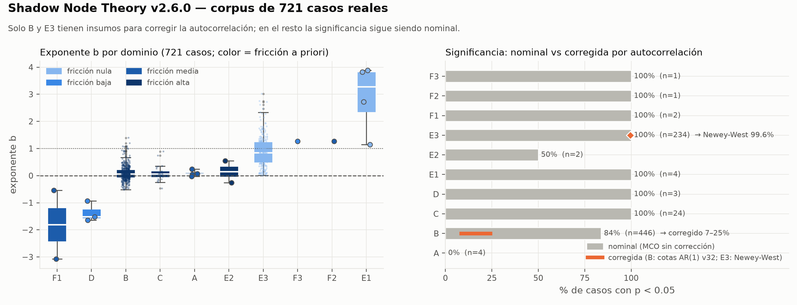
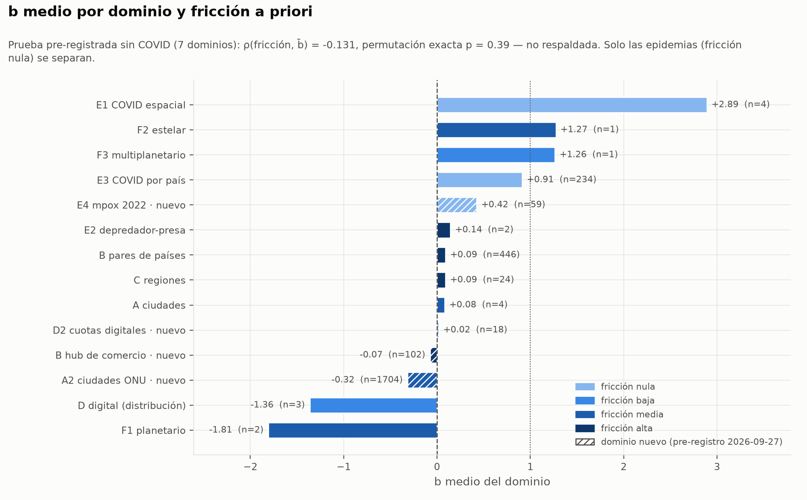
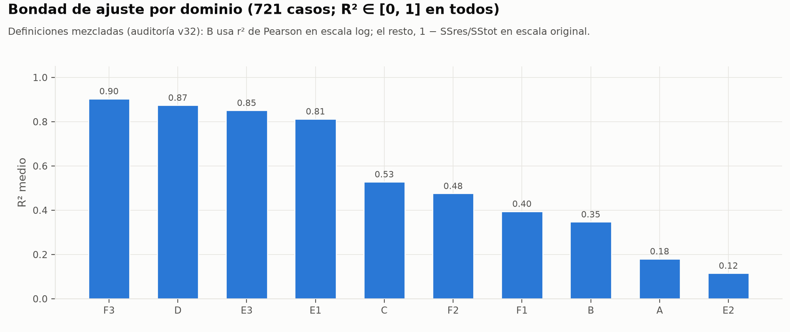
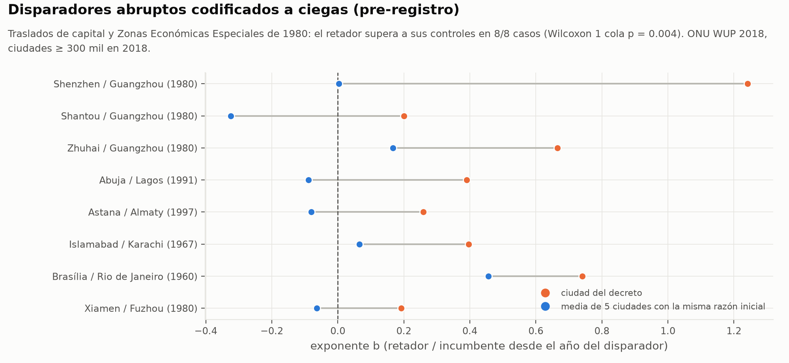
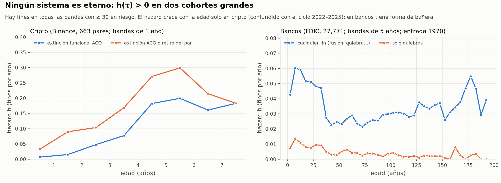

# Shadow Node Theory v2.6.1

**Elan Zainos Corona** | Fractal Core Research, Tlaxcala, Mexico

ORCID: [0009-0009-9125-253X](https://orcid.org/0009-0009-9125-253X)

[](https://ssrn.com/abstract=6418778)
[](https://doi.org/10.5281/zenodo.19446521)
[](https://github.com/Inzainos/The-shadow-Node-Theory)
[](https://github.com/Inzainos/The-shadow-Node-Theory/actions/workflows/python-package-conda.yml)

## Setup

Use Conda to install the project runtime environment:

```bash
conda env create -f environment.yml
conda activate snt-env
```

This installs the runtime dependencies defined in `environment.yml`, including `flake8` for syntax validation.

If you want to install the plain Python requirements inside the activated Conda environment later:

```bash
python -m pip install -r requirements.txt
```

For development, testing and linting tools, use the development environment:

```bash
conda env create -f environment-dev.yml
conda activate snt-dev-env
```

`environment-dev.yml` includes the runtime dependencies plus common dev tools such as `pytest`, `pre-commit`, `black`, `isort`, `mypy`, `ruff`, and `tox`.

For a quick command reference and workflow shortcuts, see `dev-guide.md`.

To update an existing environment from the YAML file:

```bash
conda env update -f environment.yml --prune
```

---

## Continuous Integration

This repository uses GitHub Actions with a Conda-based workflow located at `.github/workflows/python-package-conda.yml`.

The workflow currently:

- checks out the repository
- sets up Miniconda and creates the `snt-env` environment from `environment.yml`
- installs standard Python requirements
- runs `flake8` for syntax and undefined-name checks
- compiles active Python modules
- executes a smoke test with `python reconstruction_real/code/build_aco_v29.py`

Use the badge at the top of this README to view CI status for the default branch.

---

> **WARNING: PREVIOUS VERSION OBSOLETE**
> The 502-case corpus (v2.3.1 and earlier) contained synthetically generated
> values and an r2 column with impossible values (down to -7.332).
> Those files are preserved in `archive/` as historical record but
> **must not be cited in academic publications**.
> The active version is v2.6.1 (721-case corpus + coupled collapse layer + Domain G with first real series + audit v32, Domain B discriminant test and pre-registered tests of 2026-09-27; conceptual framework: marco teórico v34).

---

> **Versioning note**
> Repository release: **v2.6.1** (2026-09-27, patch; previous: v2.6.0, 2026-09-27;
> v2.5.3, 2026-09-26, tagged retroactively (as `2.5.3.0`) on the state that
> matches SSRN r31;
> before that v2.5.2, 2026-09-10).
> What v2.5.3 adds: the integral audit v32 findings, the Domain B edition
> (MPD2020, byte-exact) and discriminant test with bilateral trade, the Domain
> B reconstruction with trade-emergent hubs and the SSRN preprint revision r31.
> What v2.6.0 adds on top: five **pre-registered tests** (time-varying hub, friction with new
> domains, raw COVID series, blind-coded triggers, larger ACO-A cohorts) —
> see `reconstruction_real/audits/RESULTADOS_PREREGISTRO_2026-09-27.md`.
> What v2.6.1 adds (patch, no new analysis): the corrected E3 figure (conservative
> AR(1) bound, 176 of 198 estimable, instead of Newey-West 233/234), the audit
> runner computing the formerly blocked B and E3 rows, and the SSRN preprint
> revision **r32** with the pre-registered results. The 721-case corpus itself is
> **unchanged** since v2.5.2.
> Active empirical corpus: **721 real cases**
> (`reconstruction_real/data/snt_corpus_REAL_v5.csv`). Active conceptual
> framework: **marco teórico v34** (`papers/marco_teorico.md`; v33 archived in
> `archive/`). The framework and the corpus are numbered **independently**:
> a framework version can advance without the corpus advancing, and vice versa.
> References to **v30** in this README refer to manuscript / submission
> packages. The 721-case real corpus was introduced in **v2.4.0** (2026-06-26)
> and the coupled ACO-A layer in **v2.5.0** (2026-06-28).

---

> **Inference status — read before citing any p-value below**
> An internal full audit (v32, `reconstruction_real/audits/`) re-derived every
> published figure from the committed data. **The arithmetic is clean** (all
> `MASTER_cifras_v5.json` figures and all 40 cells of `MASTER_resumen_v5.csv`
> replicate), **the direction of the central finding holds, but its
> significance is inflated** by serial autocorrelation (Domain B) and by
> treating 714 non-independent cases as independent. Several headline figures
> are not reproducible from the repository. Details and the corrected figures:
> [Audit v32 — inference status](#audit-v32--inference-status).
> Audit re-run and re-verified on 2026-09-26; five pre-registered tests run on
> 2026-09-27 (box below).

> **Estado canónico de reproducibilidad (v2.6.1)**
> - **Reproducible:** Domain B reproduces byte-for-byte from the committed
>   MPD2020 source (`data/mpd2020.xlsx`) through `expand_B_massive.py`; Domain E3
>   reproduces 233/234 cases from the raw OWID series and remains significant under
>   the conservative AR(1) bound (176/198 estimable cases). The checksum ledger in
>   `data/FUENTES.md` is verified.
> - **Parcial:** the later OWID edition (`data/owid-maddison.csv`) approximates B
>   but is not the active source; the point estimate for B remains open after the
>   AR(1) correction because the effective sample is small and GLS/bootstrap checks
>   are still needed.
> - **No reproducible:** Domain E1 (4 cases) is not reproducible from the raw OWID
>   series; the historical 5.9× abrupt-vs-gradual claim is not citable against the
>   active 721-case corpus because the active corpus has no usable trigger variable.
> - **Bloqueado por datos ausentes:** the proprietary HackerEarth dataset is not
>   redistributed, and any historical claim that depends on it or on missing source
>   files must be treated as record, not as active evidence.

---

> **NEW in v2.6.0 -- pre-registered tests (2026-09-27)**
> Hypotheses, data rules and decision criteria were committed **before** any
> new data were downloaded (`reconstruction_real/preregistro/`). Results
> (`reconstruction_real/audits/RESULTADOS_PREREGISTRO_2026-09-27.md`, Figs. 1–5):
> - **Supported:** abrupt decree triggers speed up satellization (8/8 capital
>   relocations and 1980 SEZs beat same-ratio cities, p = 0.004); orthogonality
>   b ⊥ Δ (242 crypto pairs, ρ = −0.12, inside the ±0.3 equivalence band);
>   positive hazard h(τ) > 0 in 663 crypto pairs and 27,771 FDIC banks; E3
>   rebuilt from raw OWID series stays significant after the autocorrelation
>   correction (conservative AR(1) bound: 176 of 198 estimable cases).
> - **Not supported:** hub-node coupling with the current trade hub in country
>   pairs (contrary at 30 years: countries converge toward their main partner);
>   friction as a general ordering of b across new non-COVID domains
>   (ρ = −0.13, p = 0.39); a hazard that rises with age in banks (bathtub).
> - **Not reproducible:** Domain E1 (4 cases).

---

> **NEW in v2.5.0 -- Coupled Orbital Collapse layer (ACO-A)**
> Collapse is reformulated as a **universal, transversal axis** of SNT, with
> evidence in **5 domains** (finance, history, crypto, biology, astronomy) from
> real data. See [Orbital Collapse Architecture (Coupled, v2.5.0)](#orbital-collapse-architecture-coupled-v250)
> below and the full theory in `papers/SNT_Colapso_Acoplado.md`.

---

## What Is Shadow Node Theory?

When two coupled entities interact over time -- a dominant **hub** and a
peripheral **node** -- the dominance ratio evolves in a regular way.
SNT characterizes that evolution through scaling exponents estimated by fitting
power laws on logarithmic axes. Two orthogonal axes describe a system:

- **Satellization (b):** `R(t) = metric_hub(t) / metric_node(t) = a*t^b` --
  how dominance evolves *while the coupled relationship runs*.
- **Collapse (Delta):** `A(tau) = c*tau^Delta` -- how the hub's mass is
  *absorbed once it undergoes functional extinction* (the v2.5.0 layer).

The sign and magnitude of **b** summarize the direction and speed of
**satellization** -- the process by which a peripheral entity loses or gains
relative standing against a dominant core.

```
b < 0    --> convergence (node gains ground)
b ~ 0    --> dynamic equilibrium
0 < b < 1 --> sublinear satellization (gradual)
b >= 1    --> superlinear satellization -- Roche Radius
```

---

## Corpus activo v2.6.1 -- 721 cases, 100% real data (unchanged since v2.5.2)

| Domain | Friction | Cases | Sig. | b mean | Source |
|--------|----------|-------|------|--------|--------|
| A -- Cities | medium | 4 | 0% | +0.08 | UN Demographic Yearbook |
| B -- Countries | high | 446 | 84%† | +0.09 | Maddison Project Database 2020 |
| C -- Regions | high | 24 | 100% | +0.09 | US Census historical (23) + INEGI 2022 (1) |
| D -- Digital | low | 3 | 100% | -1.36 | HackerEarth 2026 |
| E1 -- Invasion (territorial spread) | none | 4 | 100% | +2.89 | OWID COVID-19 (spatial spread, 2020) |
| E2 -- Predator-prey | high | 2 | 50% | +0.15 | MacLulich 1937 / Elton & Nicholson 1942 |
| E3 -- Parasite-host | none | 234 | 100% | +0.91 | OWID COVID-19 (JHU CSSE) |
| F1 -- Planetary | medium | 2 | 100% | -1.81 | Open Exoplanet Cat. + NASA fact sheet |
| F2 -- Stellar | medium | 1 | 100% | +1.27 | Open Exoplanet Cat. |
| F3 -- Multiplanet | low | 1 | 100% | +1.26 | Open Exoplanet Cat. |
| **TOTAL** | | **721** | **89%†** | **+0.37** | |

† **Nominal** per-case significance (OLS on log-log, no autocorrelation
correction). After the audit v32 AR(1) correction, Domain B has **156/446
estimable cases** (`n_eff ≥ 3`) and **290/446 not estimable**; among the
estimable ones, significant cases fall to **33–112 (21.2%–71.8%)** depending on
the analytical variant. See [Audit v32](#audit-v32--inference-status).
Domain E3 was rebuilt from the raw OWID series on 2026-09-27 (233/234 cases
reproduced): 198/234 are estimable and **176–196 of those 198** stay
significant under the AR(1) bracket (the conservative bound, 176, is the figure
to cite; standard Newey-West gives 233/234 but under-corrects at this
persistence).

**Composition note.** The two friction-free domains (E1 + E3 = 238 cases) are
both built from **OWID COVID-19 data** (spatial spread and per-country curves).
E1 is modeled as territorial expansion, mathematically equivalent to an
invasion front, not as biological species invasion (GBIF species data were
not available).

**Integrity verified:** R² in [0,1] for all cases, p in [0,1], zero corrupt
values; SHA-256 checksums of the corpus files are pinned in `data/FUENTES.md`
(re-verified 2026-09-26). **Domain B reproduces exactly** (verified
2026-09-27): it was built from the **Maddison Project Database 2020**
(coverage 1–2018), now committed as `data/mpd2020.xlsx` and converted by
`reconstruction_real/code/build_maddison_mpd2020_csv.py`; `expand_B_massive.py`
regenerates all 446 cases **byte for byte** (SHA-256 identical to the published
`by_domain/dominio_B_real.csv`). The later OWID edition (`data/owid-maddison.csv`)
only reproduces it approximately (441 vs 446 cases, corr(b) = 0.979), because
Maddison revises historical GDP between editions. **E3 also reproduces**
(2026-09-27): 233/234 cases from the raw OWID series (versioned subset
`data/owid_covid_casos_totales.csv.gz`; recipe: cumulative cases, 60 days from
the first day with ≥ 100 cases). **Still partial:** E1 (4 cases) is not
reproducible from the raw data with any natural construction, and the
HackerEarth data are proprietary. Per-case p-values were rounded to 6 decimals, so 557/721 read
exactly `0.0`.

---

## Visualizaciones del corpus

Generated by `reconstruction_real/code/generate_readme_figures.py` from the
committed CSVs (release v2.6.0; light and dark versions).

<picture>
  <source media="(prefers-color-scheme: dark)" srcset="figures/snt_v260_fig1_distribucion_dark.png">
  
</picture>

*Fig. 1 — Exponente b por dominio (color = fricción a priori) y significancia: nominal frente a corregida por autocorrelación (cotas AR(1): B desde la auditoría v32; E3 desde las series crudas de OWID).*

<picture>
  <source media="(prefers-color-scheme: dark)" srcset="figures/snt_v260_fig2_friccion_dark.png">
  
</picture>

*Fig. 2 — b medio por dominio con fricción a priori, incluidos los dominios nuevos del pre-registro (rayados). La prueba pre-registrada sin COVID no respalda un orden por fricción (ρ = −0.131, p = 0.39).*

<picture>
  <source media="(prefers-color-scheme: dark)" srcset="figures/snt_v260_fig3_r2_dark.png">
  
</picture>

*Fig. 3 — R² medio por dominio (R² ∈ [0, 1] en todos; definiciones mezcladas: B en escala log, resto en escala original).*

<picture>
  <source media="(prefers-color-scheme: dark)" srcset="figures/snt_v260_fig4_disparadores_dark.png">
  
</picture>

*Fig. 4 — Prueba pre-registrada de disparadores abruptos: la ciudad del decreto supera a sus controles en 8/8 casos (p = 0.004).*

<picture>
  <source media="(prefers-color-scheme: dark)" srcset="figures/snt_v260_fig5_hazard_dark.png">
  
</picture>

*Fig. 5 — Hazard h(τ) por edad: positivo en todas las edades en cripto (Binance) y bancos (FDIC); creciente solo en cripto.*

---

---

## Central Finding

**As published (v30):** institutional friction predicts the satellization
exponent. **Status in v2.6.0:** the direction holds in the corpus, but the
finding is not significant at the domain level and a pre-registered test with
new non-COVID domains does not support it (details below).

**Spearman rho = -0.68, p = 2.5x10^-97** (social/biological domains, n=714)

Systems without friction (E1, E3): b mean = +0.95
Systems with friction (A, B, C): b mean = +0.09
**Mann-Whitney p = 2.4x10^-74**

**Audit v32 — the direction holds, the p-value does not.** The per-row figure
replicates exactly, but it treats 714 cases as independent when they are
clustered in a few domains, and Domain B's per-case fits are themselves
autocorrelated. Re-computed from the committed data:

| Analysis | Spearman rho | p | n |
|---|---:|---:|---:|
| Per row (published) | −0.678 | 2.5×10⁻⁹⁷ | 714 |
| Per cluster (domain means, `spearman_cluster`) | −0.556 | 0.25 | 6 domains |
| Cluster bootstrap (resampling domains) | −0.434 | IC95 [−0.722, −0.006] | 6 domains |
| Without E3 | −0.116 | 0.011 | 480 |
| Without E3 and B | −0.426 | 0.012 | 34 |

Friction is the ordinal index of `MASTER_resumen_v5.csv`. The negative sign
survives every variant, but the significance collapses at the cluster level
(p = 0.25, n = 6), the bootstrap interval nearly touches zero, and removing E3
(COVID-19) shrinks the correlation from −0.68 to −0.116. The friction-free pole
of the contrast (E1 + E3) is entirely COVID-19 data. Re-computed 2026-09-26
with `code/snt_utils_v32.py` from the committed corpus.

**Two further results (2026-09-27).** (i) The published n = 714 **excludes
Domain D** (3 HackerEarth cases that measure activity-distribution exponents,
not R(t) trajectories): without E3 and B, ρ = −0.426 (p = 0.012, n = 34)
without D but ρ = −0.145 (p = 0.39, n = 37) with D. (ii) **Pre-registered test
with new non-COVID domains** (mpox 2022, StatCounter shares, UN WUP city pairs,
trade-hub country pairs; friction coded before seeing the data): domain-level
ρ = −0.131, exact permutation p = 0.39 — **not supported**. The friction-free
pole is real (E3 rebuilt from raw OWID series stays significant after the
autocorrelation correction, and mpox also gives a high b̄ = +0.43), but outside
epidemics there is no ordering by friction. See Fig. 2 and
`reconstruction_real/audits/RESULTADOS_PREREGISTRO_2026-09-27.md`.

---

## Three Core Statistical Findings (v30, with v2.6.0 status)

| Finding | Result | Test | Status (audit v32) |
|---------|--------|------|--------------------|
| Abrupt triggers faster than gradual | **Current status: supported by a pre-registered test on a new corpus (2026-09-27; see the end of this cell).** Published: ratio 5.9x. **Recalculated 2026-09-27:** the 5.9x originates in the v1.0 table of **2 abrupt vs 2 gradual cases** (0.717 / 0.122 = 5.87x, Mann-Whitney p = 0.33, the smallest p a 2-vs-2 test can give). The historical 57-case corpus (v2.0) gives ratio 6.3, p = 0.053 two-sided, but predates v2.4.0 (7 cases with impossible R² < 0) and is not citable | Published: Mann-Whitney U=24,802, p=1.91x10^-5, n=486 — n=486 matches no dataset in the repo, and the claimed stability "57 → 114 → 721" cannot hold for 721 (no trigger variable) | **Published evidence not reproducible; untestable on the 721-case corpus.** The 721-case corpus has no usable trigger variable (`trigger` fixed to `'gradual'` in B). The 18 ACO cases carry a trigger label but measure a **different exponent** (absorption, R = absorber mass / collapsing-hub peak), so they test RC-ACO-2, not this claim: there gradual ≥ abrupt (0.47×, p = 0.10, n.s.; trigger confounded with domain). Script: `reconstruction_real/code/recalculo_trigger_abrupto_gradual.py`. **Pre-registered test 2026-09-27 (new corpus, cities):** decree-driven challengers (capital relocations, 1980 SEZs) beat same-country cities with the same initial ratio in 8/8 cases (one-sided Wilcoxon p = 0.0039; capitals 4/4, b ratio 5.1×) — **supported**, with a survivor-filter caveat (UN WUP lists only cities ≥ 300k in 2018). |
| Institutional friction is dominant predictor of b | Friction-free: b~+0.95 / High friction: b~+0.09 | Spearman rho=-0.68, p=2.5x10^-97, n=714 | **Direction holds, p inflated**: cluster-level rho=−0.556, p=0.25 (n=6 domains). See [Central Finding](#central-finding). **Pre-registered test 2026-09-27 with new non-COVID domains** (mpox, StatCounter shares, UN WUP city pairs, trade-hub country pairs): domain-level ρ = −0.131, exact permutation p = 0.39 — **not supported**; the epidemic pole replicates (mpox b̄ +0.43) but there is no ordering among low/medium/high friction. Note: the published n = 714 excludes Domain D (distribution exponents); with D, without E3 and B, ρ = −0.145 (p = 0.39, n = 37). |
| Sovereignty = interdependence as brake | Country pairs (B, n=446, b~+0.09) vs predator-prey (E2, b~+0.15) statistically indistinguishable | Regime split MW p=2.4x10^-74 | **Rests on Domain B**, which the discriminant test leaves **inconclusive**: `b` in B is supported neither as SNT hub-satellite coupling nor as β-convergence (85% of hubs also appear as satellites; the observed statistic falls inside the calibrated null). Block 2 (bilateral trade, 2026-09-27) finds no coupling signal and a robust **negative** association between initial trade integration and b. Rebuilt with trade-emergent hubs (2026-09-27), the hub diverges no more than a same-gap non-partner (p = 0.78) and 62/95 nodes converge toward it. |

---

## Audit v32 — inference status

Full report (Spanish): [`reconstruction_real/audits/AUDITORIA_INTEGRAL_v32.md`](reconstruction_real/audits/AUDITORIA_INTEGRAL_v32.md).
Machinery: `code/snt_utils_v32.py` (backward-compatible extension of
`code/snt_utils.py`) + `reconstruction_real/code/snt_auditoria_integral_v32.py`
(single runner, CSV output). Regression test:
`reconstruction_real/tests/test_correccion_ar1.py`. **Re-run on 2026-09-26: all
replicable figures replicate.**

```bash
python reconstruction_real/code/snt_auditoria_integral_v32.py   # -> reconstruction_real/data/auditoria_integral_v32_resultados.csv
pytest reconstruction_real/tests                                 # fixes 156 / 290 / 33 / 112
```

### What holds

| Block | Result |
|---|---|
| `MASTER_cifras_v5.json` | **8/8 replicate exactly** (n_total, n_sig, pct_sig, b_mean, b_median, pct_b_pos, pct_b_super, r2_sig) |
| `MASTER_resumen_v5.csv` | **40/40 cells, 0 discrepancies** |
| N-body Mexico | b = −0.4732, R²_raw = 0.8377 — replicates (see caveat above) |
| ACO, 18 cases | b̄ = +0.60, 17/18 significant; 0/18 with negative raw R² |
| H-φ | Consistent with refuted |
| Direction of the friction–b relation | Negative in every variant (per row, per cluster, bootstrap, without E3, without E3 and B) |

### What changes

1. **Serial autocorrelation in Domain B (62% of the corpus).** Durbin-Watson
   median 0.112; 445/446 cases with DW < 1; implied AR(1) ρ median 0.944;
   **effective n median 2.2** (nominal 69). Corrected picture:

   | Step | Figure |
   |---|---:|
   | Estimable (`n_eff ≥ 3`) | **156 / 446 (35.0%)** |
   | **Not estimable** (`n_eff < 3`) — not "non-significant" | **290 / 446 (65.0%)** |
   | Significant among estimable — lower bound (inflated SE + df) | **33 (21.2%)** |
   | Significant among estimable — upper bound (df only) | 112 (71.8%) |
   | Point value | still open: standard Newey-West (lag 4, computed 2026-09-27 on the Maddison series) gives 120/156, **above** the upper bound — it under-corrects at ρ ≈ 0.94; needs GLS or a block bootstrap |

2. **The superlinear regime b ≥ 1 may be model misspecification.** RC1 had no
   script behind it; tested by AIC on the 18 raw ACO series: power law wins
   13/18, exponential 4/18, linear 1/18. The 4 exponential winners have mean
   **b = +1.54**: the higher b, the worse the power law fits. The 14.1% of the
   corpus (102/721) labelled superlinear therefore needs re-testing; since
   2026-09-27 the raw E3 series (94 of those 102 cases are E1 + E3) are in the
   repo, so the test is now feasible for E3 (still pending).
3. **Central finding: direction holds, p does not** — double inflation
   (autocorrelation + 714 non-independent cases). See
   [Central Finding](#central-finding).
4. **Reporting defects.** 557/721 p-values truncated to `0.0` by `round(p, 6)`;
   two R² definitions averaged together in `r2_mean` (Domain B uses Pearson r²
   on log scale, the rest use 1 − SSres/SStot on raw scale); `trigger`
   hardcoded to `'gradual'` in both Domain B builders (`expand_B_massive.py`,
   `expand_dominio_B.py`).

### Not reproducible from the repository

| Figure | Why |
|---|---|
| 5.9× abrupt vs gradual (U=24,802, n=486) | n=486 matches no dataset in the repo; the U/p appear only as fixed text in the v28 script `code/generate_publication_figures.py`. **Recalculated 2026-09-27** on every trigger-labeled dataset: the ratio comes from v1.0 (2 vs 2 cases, 5.87×); the active satellization corpus cannot test it; the ACO cases measure a different (absorption) exponent. RC3 is now UNTESTABLE (see the findings table) |
| ASI ROC-AUC 0.715 | Retention target not in `data/snt_asi_scores.csv` (proprietary source) |
| N-body refit from raw | Committed file is a one-row summary |

**Correction to the audit (re-verified 2026-09-26):** the audit listed RC9
(ρ = +0.009, crypto, n = 11) as not verifiable. The paired (b_rise, Δ_fall)
data **are** committed in `reconstruction_real/data/orthogonality_crypto_v25.csv`
and the statistic replicates exactly (Spearman ρ = +0.009, p = 0.98, n = 11).
Scope unchanged: within crypto only; re-fitting each coin's exponents needs
network access (`reconstruction_real/code/orthogonality_test.py`).

### Domain B discriminant test (2026-07-25; re-run with MPD2020 2026-09-27)

Report: [`reconstruction_real/audits/DISCRIMINANTE_DOMINIO_B.md`](reconstruction_real/audits/DISCRIMINANTE_DOMINIO_B.md).
Question: does `b` in Domain B measure SNT hub–satellite coupling or
β-convergence of GDP per capita?

- **Block 0 (firm, no assumptions):** the "hub" role is a property of the pair,
  not of the country — **77/91 countries (85% of hubs) also appear as
  satellites**.
- **Block 1: INCONCLUSIVE (confounded).** Gap and `b` come from the same fit
  and the hub is assigned by mean GDP, which anticorrelates them by
  construction, so the observed ρ is compared against a null calibrated to
  real Maddison data (Block 1d), not against zero. **Re-run 2026-09-27 with the
  corpus edition (MPD2020, all 446 pairs; 5000 null iterations):**

  | Test | Observed ρ | Calibrated null: mean [IC95] | Position · empirical p |
  |---|---:|---:|---|
  | Block 1 (full series) | −0.4893 | −0.4226 [−0.5765, −0.2418] | inside · 0.213 |
  | Block 1c (disjoint halves) | −0.3846 | −0.2508 [−0.4050, −0.0788] | inside · **0.050** |

  The original run used the later OWID edition (441 pairs: −0.4725 / −0.3676,
  empirical p 0.287 / 0.080). The clean split test (1c) is now **borderline**
  (one-sided p = 0.050, 0.020 from the interval edge): weak, non-conclusive
  evidence of convergence beyond the hub-assignment artefact.
- **Block 2 (SNT coupling, run 2026-09-27):** bilateral trade from the
  Correlates of War Trade v4.0 (1870–2014; `data/COW_Trade_4.0.zip` →
  `data/comercio_bilateral.csv`), 432 of 446 pairs. SNT predicts b rising with
  the node's export share to its hub. **Not supported:**

  | Trade regressor | Per row (n = 432) | Cluster by node (88) | Within-region permutation |
  |---|---:|---:|---:|
  | Mean export share node→hub | ρ = −0.043 (p = 0.37) | +0.024 (p = 0.83) | p = 0.72 |
  | Initial export share node→hub | **ρ = −0.185** (p = 1.1×10⁻⁴) | **−0.245 (p = 0.022)** | **p = 0.026** |

  The only robust trade signal has the **opposite sign**: stronger initial trade
  integration with the hub goes with **lower** b (more convergence).
- **Block 3 (joint model):** R² = 0.290 with both regressors; gap alone 0.286;
  **trade share alone 0.0001** — trade adds no explanatory power.
- **Verdict:** Domain B is **not supported as SNT coupling** (tested directly,
  with the assigned hub) and **not proven as β-convergence** (Block 1
  inconclusive against the calibrated null), though both Block 1c and the
  initial trade share lean toward convergence.

### Domain B rebuilt with a trade-emergent hub (2026-09-27)

Report: [`reconstruction_real/audits/RECONSTRUCCION_DOMINIO_B_HUB_COMERCIO.md`](reconstruction_real/audits/RECONSTRUCCION_DOMINIO_B_HUB_COMERCIO.md).
Each of the 103 Domain B countries gets as hub its **largest export destination
in its first decade of COW data** (predetermined with respect to the later
trajectory), and R(t) is fitted exactly as in Domain B.

- 102/103 countries rebuilt; 19 distinct hubs (United Kingdom 37, United States
  27, France 7, Germany 7, Japan 5). Only **9 of the 102** trade hub–node pairs
  exist in the published Domain B, and the main destination changes by
  2005–2014 for 77/102 countries.
- With the hub richer at the start, **62/95 nodes converge toward it** (b < 0).
  ρ(b, initial gap) = −0.153 (p = 0.125) vs −0.489 in Domain B — most of that
  correlation was the mean-GDP hub assignment.
- **Coupling test** (trade hub vs up to 5 non-partners with the same initial
  gap): median difference −0.014, positive in 45/102, Wilcoxon p = 0.78
  (clustered by hub p = 0.62; same without the CMEA countries whose Soviet trade
  COW leaves missing). **No coupling.** A whole-window hub gives d > 0
  (p = 5×10⁻¹⁰), but that is reverse causality by gravity (the fastest-growing
  economy becomes the largest destination), so it is not evidence.
- Within-country test across partners (partial ρ of b with export share, given
  the gap): median +0.115, Wilcoxon p = 0.046, sign-flip permutation p = 0.15;
  controlling partner size, sign p = 0.10 — **not conclusive**.
- **Verdict:** the reconstruction does **not** rescue the coupling reading of
  Domain B. The published domain is unchanged (it stays the reproducible corpus
  of the release, unchanged since v2.5.2); whether to replace or retire it is an author decision.

### Reproducibility status

- **Domain B — exact.** The corpus edition is the **Maddison Project Database
  2020** (`data/mpd2020.xlsx`, SHA-256 pinned in `data/FUENTES.md`), located
  and verified on 2026-09-27. `build_maddison_mpd2020_csv.py` converts it to
  `data/maddison_mpd2020.csv` and `expand_B_massive.py` regenerates all 446
  cases byte for byte. The audit runner re-checks this on every run (it now
  regenerates B in a temporary directory instead of carrying a fixed row).
- `data/owid-maddison.csv` — later OWID edition (downloaded 2026-07-25), used by
  the first runs of the Domain B discriminant test (the test now defaults to
  MPD2020). With it B reproduces only approximately (441
  vs 446 cases, corr(b) = 0.979, 12/408 identical b). `expand_dominio_B.py` is
  an earlier script (254 cases) and does not reproduce the published domain.
- Raw COVID-19 series — **obtained** (2026-09-27): OWID `owid-covid-data.csv`
  (SHA-256 in `data/FUENTES.md`), versioned subset
  `data/owid_covid_casos_totales.csv.gz`. E3 reproduces 233/234 and its AR(1)
  correction is done (`covid_E3_series_crudas.py`: 176–196 of 198 estimable
  stay significant); E1 is not reproducible.
- Bilateral trade — **obtained**: Correlates of War Trade v4.0
  (`data/COW_Trade_4.0.zip`, SHA-256 pinned in `data/FUENTES.md`), rebuilt into
  `data/comercio_bilateral.csv` by `build_comercio_bilateral_cow.py`; used by
  Block 2 of the discriminant test (432 of 446 pairs).

### Pending (order suggested by the audit)

1. ~~AR(1)-correct E3~~ — done 2026-09-27 from the raw OWID series (pre-registration,
   point 3): conservative AR(1) bound, 176 of 198 estimable cases significant. The
   other domains still need their raw series; Domain B's point value needs GLS or a
   block bootstrap (standard Newey-West under-corrects).
2. ~~Update the SSRN v30 EN preprint~~ — revised manuscript **r31** prepared
   2026-09-27 (`papers/snt_ssrn_v31_EN.md` / `.pdf` / `.docx`; v30 kept
   unchanged as the submitted record). It withdraws the 5.9× claim, corrects the
   leaked HackerEarth ROC-AUC (0.9994 → 0.715 ± 0.019), withdraws the tautological
   ASI "precision = 1.0", adds the clustering/autocorrelation caveats to the
   friction finding, and reports the discriminant test and the trade-hub
   reconstruction of Domain B. Spanish version `papers/snt_ssrn_v31.*` and the
   SSRN form text `papers/SSRN_revision_v31.md` added the same day. r31 was never
   uploaded: it is superseded by **r32** (2026-09-27, `papers/snt_ssrn_v32_EN.*`,
   Spanish `snt_ssrn_v32.*`, form text `papers/SSRN_revision_v32.md`), which adds
   the five pre-registered tests and the E3 raw-series correction. **Uploading r32
   to SSRN is pending (author action).** PLOS is deferred until the theory is
   resubmitted once refined.
3. Test b ≥ 1 on the other domains' raw series (now feasible for E3, whose raw
   series are in the repo since 2026-09-27).
4. Report exact p-values and split `r2_log` / `r2_raw` in the consolidated corpus.
5. ~~Decide on the 5.9× figure~~ — recalculated 2026-09-27: not reproducible and
   untestable on the active corpus; RC3 changed to UNTESTABLE (see the findings
   table and `reconstruction_real/data/trigger_abrupto_gradual_recalculo.csv`).
   The SSRN v30 EN abstract states this figure; SSRN r31/r32 withdraw it (item 2).
   Later on 2026-09-27 a pre-registered test on a new city corpus supported the
   abrupt-trigger prediction (item 11; RC3 now NOT REFUTED).
6. ~~Mark `soberania` as derived from ASI~~ — done (`data/snt_asi_scores_README.md`).
7. ~~Pin the Maddison edition of Domain B and re-run the discriminant test with
   it~~ — done 2026-09-27 (MPD2020: exact reproduction; test still inconclusive,
   split test borderline at p = 0.050).
8. ~~Block 2 of the discriminant test (bilateral trade matrix)~~ — done
   2026-09-27 with COW Trade v4.0: SNT coupling not supported; initial trade
   integration goes with lower b.
9. ~~Rebuild Domain B with a hub that emerges from the trade network~~ — done
   2026-09-27: coupling not recovered (trade hub diverges no more than a
   same-gap non-partner; 62/95 nodes converge toward their hub).
10. ~~Time-varying hub definition~~ — done 2026-09-27 (pre-registered point 1):
    no coupling with the current trade hub either (H = 20 not supported;
    H = 30 contrary). See
    `reconstruction_real/audits/RESULTADOS_PREREGISTRO_2026-09-27.md`.
11. Pre-registered tests 2026-09-27 (six points requested by the author): see
    the results report above — friction across new non-COVID domains not
    supported; E3 recovered from raw data and robust to autocorrelation; E1 not
    reproducible; abrupt decree triggers supported on cities; b ⊥ Δ supported
    (n = 242); h > 0 supported in crypto and banks, rising hazard only in crypto.
12. Open after the pre-registration: age-period-cohort separation of the crypto
    hazard; friction → Δ with a larger cohort (no public absorption series yet);
    a trigger corpus without the UN WUP ≥ 300k survivor filter.

---

## Publication Status

| Target | Status | Notes |
|--------|--------|-------|
| **SSRN** (abstract 6418778) | REVISION SUBMITTED · r32 READY | **v30 revision submitted 28 Jun 2026** (`papers/snt_ssrn_v30_EN`); supersedes v2.3.1/502. **r32 prepared 27 Sep 2026** (`papers/snt_ssrn_v32_EN`, Spanish `snt_ssrn_v32`, form text `SSRN_revision_v32.md`): audit v32 corrections (5.9× withdrawn, ROC-AUC 0.715, ASI precision withdrawn, friction caveats, Domain B discriminant test and trade-hub reconstructions) plus the five pre-registered tests; upload pending (author). r31 (same day) was superseded before upload |
| **Zenodo** (DOI 10.5281/zenodo.19446521) | PUBLISHED | 721-case corpus archive record (v2.5.0 snapshot; active repo release: v2.6.1) |
| **PLOS Complex Systems** (PCSY-D-26-00059) | REVISION SUBMITTED | v30 revision package submitted (`snt_plos_v30` + `plos_response_to_reviewers_v30`); addresses both reviewers; awaiting decision |
| **J. Complex Networks** (COMNET-2026-214) | REJECTED | No external review |
| **MIT GCFP Conference** | SUBMITTED | 13th Annual Conf, Oct 29-30 2026; paper + abstract submitted (`papers/mit_gcfp_2026_*`) |
| J. Theoretical Biology | NOT RELEASED | Requires v30 update |
| Astrophysical Journal | NOT RELEASED | Requires v30 update |
| Investigacion Economica | NOT RELEASED | Requires v30 update |

---

## N-Body Matrix Correction -- Mexican National System

Standard binary models (Tlaxcala vs Puebla) underestimate Tlaxcala's satellization
gradient by 9.3x because 89.2% of extraction flows toward CDMX, not Puebla.
The N-body correction (32 federal entities, INEGI 2022) reveals a power-law
distribution of satellization weights (b=-0.473, R2=0.838, p<0.001) consistent
with preferential attachment predictions. Queretaro (b=-0.155) and Nuevo Leon
(b=-0.058) document the first confirmed leapfrog cases within the national
system.

**Audit v32:** the fit replicates exactly (b = −0.4732, R²_raw = 0.8377,
p = 7.5×10⁻¹⁵). Caveat, not an error: a rank-size fit over 32 ordered entities
yields a high R² almost by construction, so it is not by itself evidence of
preferential attachment until it is compared against a lognormal alternative
(Clauset et al. 2009). The committed file is a one-row summary; the rank-size
series needed to refit from raw data is not in the repo.

---

## Módulo XVI -- Arquitectura de Colapso Orbital (ACO)

ACO extends SNT to cases where a hub undergoes **functional extinction** and its
resources are **absorbed by an identifiable node**. Without both elements, the
case is classical SNT satellization, not ACO.

| Domain | Cases | b mean | Sig. | Notes |
|--------|-------|--------|------|-------|
| F -- Financial | 6 | +0.13 | 6/6 | 2008 crisis: Lehman, Bear Stearns, WaMu, Wachovia, Merrill, Chrysler |
| T -- Technological | 4 | +1.09 | 4/4 | Nokia, Compaq, Sun, MySpace |
| H -- Historical | 4 | +0.46 | 3/4 | USSR, Rome, Aztec Empire, Carthage |
| I -- Industrial | 4 | +0.96 | 4/4 | Pan Am, Polaroid, Kodak, Blockbuster |
| **TOTAL** | **18** | **+0.60** | **17/18** | 14 verified, 4 estimated (*) |

Reproduced via `reconstruction_real/code/build_aco_v29.py`.

---

## Orbital Collapse Architecture (Coupled, v2.5.0)

Introduced in v2.5.0 and retained in the active v2.6.1 release, this layer
reformulates collapse as a **universal, transversal axis** of SNT. A
system has two orthogonal coordinates **(b, Delta)**: satellization (b) and the
collapse/absorption exponent (Delta), fit on its own clock tau from functional
extinction. A third layer, the hazard **h(tau) > 0**, states the falsifiable
"no system is eternal".

**Pre-registered hazard test (2026-09-27):** h(τ) > 0 holds in two large,
independent cohorts — 663 Binance crypto pairs (124 functional extinctions,
ends in all 8 age bands with ≥ 30 at risk) and 27,771 FDIC-insured banks
(23,505 ends, all 39 five-year age bands from 0 to 195 years). The v30 claim
that the hazard **rises with age** holds only in crypto (ρ = +0.88, p = 0.002),
where age is confounded with the 2022–2025 bear market; banks show a bathtub
shape (not rising). Details: `reconstruction_real/audits/RESULTADOS_PREREGISTRO_2026-09-27.md`.

**The collapse mode is governed by friction x trigger x (floor/ceiling):**

| Mode | Condition | Shape | Witness (real data) |
|------|-----------|-------|---------------------|
| **Regulated Orbital Decay** | high friction (physical or institutional) | smooth power law | 2008 cohort (R2 0.85-0.99); Rome/USSR; **astro** |
| **Cracquelure Decay** | friction~0 + gradual | erratic fragmentation | EOS (R2 0.10-0.70) |
| **Floor-Arrested** | friction~0 + abrupt + floor | power law to a residual floor | FTX/FTT (PL R2 0.875) |
| **Catastrophic Cliff** | friction~0 + abrupt + no floor | super-exponential, accelerating | LUNA (5.6 OOM / 11 days) |
| **Logistic Sweep** | bounded magnitude (frequency) | S-curve | Delta->Omicron (k=0.22/day) |

**Five-domain evidence (real data).** Collapse demonstrated in finance, history,
crypto, biology and astronomy. Highlights: solar flare X-ray decay (NOAA GOES,
power law R2=0.975); tidal disruption event AT2019qiz (NASA/ZTF, ~t^-5/3);
Delta->Omicron sweep (CoV-Spectrum). Full table:
`reconstruction_real/data/collapse_multidomain_v29.csv`.

**Principle of Least Friction (unifying).** Collapse follows the path that
minimizes integrated friction -- gradient flow on a stability landscape. The
friction field's geometry (x trigger x floor) decides which mode emerges. This
extends the central SNT finding: friction governs **b** (the satellization
speed) *and* the **shape of Delta** (the collapse mode).

Theory: `papers/SNT_Colapso_Acoplado.md`. Figures (stability landscapes / "valles"
+ fold catastrophe): `figures/fig_paisajes_colapso.*`,
`figures/fig_catastrofe_cuspide.*`. *(Draft -- correlational, see caveats.)*

---

## Atomic Sovereignty Index (ASI)

ASI = delta_H x alpha / F

Where delta_H = Shannon entropy of behavioral sequence, alpha = autonomy ratio
(self-directed vs prompted actions), F = friction index. Applied to 4,774
HackerEarth users (409,287 events), ASI achieves held-out ROC-AUC = 0.715
using exclusively first-session features. The 5-Event Wall is the activation
threshold. The dominant retention predictor is AI agent adoption -- interpreted
as cognitive leapfrog.

**Audit v32:** the ASI formula replicates exactly from `data/snt_asi_scores.csv`.
The ROC-AUC 0.715 (the value already corrected for data leakage in v2.3.1) is
**not reproducible from the repo**: its retention target is not in the
committed CSV (the source dataset is proprietary). The `soberania` column is a
**threshold of ASI** (perfect separation at ASI ≈ 1; 13/4,774 = 0.27%
positives), so using it as a prediction target would be circular by
construction (see `data/snt_asi_scores_README.md`).

---

## Repository Structure

```
The-shadow-Node-Theory/
|
|-- README.md                          <-- this file (release v2.6.1, marco teórico v34)
|-- CHANGELOG.md                       <-- Version history (es)
|-- AGENTS.md / CLAUDE.md              <-- Operating guide for AI agents (branch -> PR -> merge, real data first)
|-- CONTRIBUTING.md                    <-- Contribution guide (es)
|-- dev-guide.md                       <-- Developer command reference
|-- SECURITY.md                        <-- Security and sensitive-data policy (PHI, secrets, proprietary data)
|-- LICENSE                            <-- MIT (code) + CC BY 4.0 (data) + CC BY-NC 4.0 (papers)
|-- CITATION.cff                       <-- Citation metadata
|-- sources.md                         <-- Bibliographic sources by domain
|-- requirements.txt                   <-- Python dependencies
|-- environment.yml / environment-dev.yml <-- Conda runtime / development environments
|-- .flake8                            <-- Lint configuration (single source of truth)
|-- .github/workflows/
|   |-- python-package-conda.yml       <-- CI: flake8 -> compileall -> ACO smoke test
|   +-- build-manuscript-docx.yml      <-- Manual workflow: Markdown manuscript -> DOCX
|
|-- reconstruction_real/               <-- REAL CORPUS (active, release v2.6.1; corpus unchanged since v2.5.2)
|   |-- README.md                      <-- Methodology and sources
|   |-- snt_phi_hypothesis.md          <-- H-phi REFUTED (4 rounds + placebo)
|   |-- audits/                        <-- Statistical audits of the corpus
|   |   |-- README.md                  <-- Audit index + follow-up
|   |   |-- AUDITORIA_INTEGRAL_v32.md  <-- Full audit v32 (inference layer)
|   |   +-- DISCRIMINANTE_DOMINIO_B.md <-- Domain B: coupling vs convergence (inconclusive)
|   |   +-- RECONSTRUCCION_DOMINIO_B_HUB_COMERCIO.md <-- Domain B rebuilt with trade-emergent hubs (no coupling)
|   |-- code/
|   |   |-- expand_B_massive.py        <-- Builds Domain B (446 cases); byte-identical reproduction from data/maddison_mpd2020.csv
|   |   |-- build_maddison_mpd2020_csv.py <-- data/mpd2020.xlsx -> data/maddison_mpd2020.csv (SHA-256 checked)
|   |   |-- expand_dominio_B.py        <-- Earlier regional expansion (254 cases; does NOT reproduce the 446)
|   |   |-- build_dominio_B.py         <-- Original Domain B builder
|   |   |-- recalculo_trigger_abrupto_gradual.py <-- Recalculation of the abrupt-vs-gradual claim (5.9x)
|   |   |-- build_aco_v29.py           <-- ACO 18 cases, 4 domains (CI smoke test)
|   |   |-- collapse_multidomain.py    <-- Collapse repro manifest + fit funcs (v2.5.0)
|   |   |-- make_collapse_landscapes.py <-- Stability-landscape figures (v2.5.0)
|   |   |-- generate_figures_v29.py    <-- v29 PLOS-compliant figures (SVG+PNG)
|   |   |-- friction_operational.py    <-- Roadmap #1: operationalizing friction (2008 cohort)
|   |   |-- orthogonality_test.py      <-- Roadmap #2: corr(b, Delta), crypto n=11 (RC9)
|   |   |-- bio_unbounded_collapse.py  <-- Roadmap #3: biology with unbounded collapse magnitude
|   |   |-- hazard_crypto.py           <-- Roadmap #4: hazard h(tau) > 0
|   |   |-- build_dominio_G.py         <-- Domain G: cosmic packages, 5 cases; G03 Bennu n=3 fitted b=-1.37 R²=0.93 p=0.12 (v2.5.2)
|   |   |-- snt_auditoria_integral_v32.py <-- Audit v32 runner (CSV output)
|   |   |-- prueba_discriminante_dominio_B.py <-- Domain B discriminant test (Blocks 0-3)
|   |   |-- build_comercio_bilateral_cow.py <-- data/COW_Trade_4.0.zip -> data/comercio_bilateral.csv (Block 2 input)
|   |   |-- reconstruccion_B_hub_comercio.py <-- Domain B with trade-emergent hub + coupling tests
|   |   +-- md_to_docx.py / md_to_pdf.py <-- Manuscript renderers
|   |-- data/
|   |   |-- snt_corpus_REAL_v5.csv     <-- 721 consolidated cases (ACTIVE)
|   |   |-- MASTER_cifras_v5.json      <-- All paper figures (8/8 replicate, audit v32)
|   |   |-- MASTER_resumen_v5.csv      <-- Summary by domain (40/40 replicate, audit v32)
|   |   |-- by_domain/                 <-- Individual CSVs per domain (A-F + ACO) with declared sources
|   |   |-- DOMINIO_B_METODOLOGIA.md   <-- Domain B methodology
|   |   |-- snt_corpus_aco_v29.csv     <-- ACO 18 cases
|   |   |-- snt_corpus_aco_timeseries_v29.csv <-- ACO raw series (used by the RC1 AIC test)
|   |   |-- collapse_multidomain_v29.csv <-- 5-domain collapse table (v2.5.0)
|   |   |-- orthogonality_crypto_v25.csv <-- RC9 pairs (b_rise, Delta_fall), crypto n=11
|   |   |-- hazard_crypto_v25.csv      <-- Hazard fits (crypto)
|   |   |-- snt_corpus_dominio_G*.csv  <-- Domain G metadata, series, complementary fits (v2.5.2)
|   |   |-- snt_corpus_dominio_G_fuentes.md <-- Domain G primary sources (v2.5.2)
|   |   |-- auditoria_integral_v32_resultados.csv <-- Audit v32 output (regenerable)
|   |   |-- dominio_B_corregido_ar1_v32.csv <-- Domain B with per-case AR(1) correction
|   |   |-- trigger_abrupto_gradual_recalculo.csv <-- Abrupt-vs-gradual recalculation output
|   |   |-- discrim_bloque1_convergencia.csv / discrim_bloque1c_split.csv / discrim_bloque2_acoplamiento.csv <-- Discriminant test outputs
|   |   |-- dominio_B_hub_comercio.csv / dominio_B_hub_comercio_intra_nodo.csv <-- Trade-hub reconstruction outputs
|   |   |-- phi_test_corpus_real_v4.csv <-- H-phi test corpus
|   |   +-- snt_corpus_REAL_v3.csv / snt_corpus_REAL_v4.csv <-- Previous corpus snapshots
|   +-- tests/
|       +-- test_correccion_ar1.py     <-- Regression test: fixes 156 / 290 / 33 / 112
|
|-- papers/                            <-- Conceptual framework + academic submissions
|   |-- marco_teorico.md               <-- ACTIVE conceptual framework v34: projection layer (Axioms 0.1/0.2), friction as scalar field, collapse cymatics; additive over v33 (SNT corpus v2.5.2)
|   |-- CHANGELOG_marco.md             <-- Framework lineage v01 -> v34
|   |-- marco_teorico_v31_patch.md     <-- v31 patch (Living Landscape principle, Ax-M1–M4)
|   |-- marco_teorico_v30.md / .pdf / .docx <-- COMPLETE framework v30 (full v27 body restored + corpus v30 + collapse layer + phi r4; 76 pp)
|   |-- marco_teorico_v30_EN.md / .pdf / .docx <-- COMPLETE framework v30 (English, 65 pp)
|   |-- marco_teorico_v28.pdf          <-- Unified framework (ES) v28
|   |-- SNT_Colapso_Acoplado.md        <-- Coupled Collapse theory (v2.5.0)
|   |-- snt_plos_v30.md / .pdf / .docx <-- PLOS revised manuscript v30 (721 cases; addresses reviewers) [CURRENT]
|   |-- plos_response_to_reviewers_v30.md / .pdf / .docx <-- PLOS point-by-point response letter
|   |-- snt_plos_721cases_v29_DRAFT.docx <-- PLOS revision draft (721 cases, v29)
|   |-- snt_ssrn_v32_EN.md / .pdf / .docx <-- SSRN preprint r32 ENGLISH (audit v32 corrections + pre-registered tests) [CURRENT, upload pending]
|   |-- snt_ssrn_v32.md / .pdf / .docx <-- SSRN preprint r32 Spanish (translation of the EN r32)
|   |-- SSRN_revision_v32.md           <-- SSRN form text for r32 (title, abstract, keywords, JEL, revision comments)
|   |-- snt_ssrn_v31_EN.md / .pdf / .docx <-- SSRN preprint r31 ENGLISH (superseded by r32 before upload; record, = tag 2.5.3.0)
|   |-- snt_ssrn_v31.md / .pdf / .docx <-- SSRN preprint r31 Spanish (record)
|   |-- SSRN_revision_v31.md           <-- SSRN form text for r31 (record; never uploaded)
|   |-- snt_ssrn_v30_EN.md / .pdf / .docx <-- SSRN preprint v30 ENGLISH (submitted 28 Jun 2026; record)
|   |-- snt_ssrn_v30.md / .pdf / .docx <-- SSRN preprint v30 Spanish (721 real cases + collapse layer ACO-A)
|   |-- SSRN_revision_v30.md           <-- SSRN revision notes
|   |-- mit_gcfp_2026_paper.md / .pdf  <-- MIT GCFP paper (friction regularizes collapse; 2008 + 5 domains)
|   |-- mit_gcfp_2026_abstract.md / .pdf <-- MIT GCFP abstract
|   |-- snt_paper_theoretical_biology_v30.md <-- J. Theoretical Biology draft (not released)
|   |-- snt_paper_regional_economics_en.pdf <-- Regional economics paper (EN)
|   |-- SNT_Project_Report_v29.pdf     <-- Handover document (v29)
|   |-- SNT_Genomic_Topologic_Analyzer_v3.pdf <-- Genomic agent docs
|   |-- phi_retest.py / phi_placebo.py <-- H-phi re-test and placebo control
|   |-- abstracts_marco_teorico.docx   <-- Abstracts & framework
|   +-- cover_letter_comnet.txt
|
|-- code/                              <-- Shared utilities + historical scripts (v28)
|   |-- snt_utils.py                   <-- Shared utilities (power-law fitting)
|   |-- snt_utils_v32.py               <-- Audit v32 extension (DW, n_eff, AIC, MLE-Clauset, cluster Spearman, FDR)
|   |-- hackerearth_validation_final.py <-- ASI / ROC-AUC validation (needs the proprietary dataset)
|   |-- matriz_mexico_ncuerpos.py      <-- N-body matrix Mexico (32 states)
|   |-- snt_v2_vectorizacion.py        <-- Trajectory vectorization (8 states)
|   +-- generate_publication_figures.py / snt_corpus_biological.py / snt_corpus_astronomical.py <-- DEPRECATED (502-case / v2.2 corpus)
|
|-- data/                              <-- Source data + provenance
|   |-- FUENTES.md                     <-- Provenance: URLs, editions, SHA-256 checksums
|   |-- mpd2020.xlsx                   <-- Maddison Project Database 2020 (primary source of Domain B)
|   |-- maddison_mpd2020.csv           <-- MPD2020 with OWID country names (input of expand_B_massive.py)
|   |-- owid-maddison.csv              <-- Later OWID/Maddison edition (edition-sensitivity runs; B only approximate)
|   |-- COW_Trade_4.0.zip              <-- Correlates of War Trade v4.0, dyadic 1870-2014 (primary source, Block 2)
|   |-- comercio_bilateral.csv         <-- Directed node->hub exports + rest of world per country-year (Block 2 input)
|   |-- snt_asi_scores.csv             <-- ASI scores HackerEarth (aggregate)
|   |-- snt_asi_scores_README.md       <-- ASI columns; `soberania` = ASI threshold (circular as target)
|   |-- matriz_mexico_32.csv           <-- 32 states INEGI
|   |-- snt_v2_vectores.csv            <-- Trajectory vectors 8 states
|   |-- phi_validation_crypto.csv      <-- H-phi validation round 1
|   |-- phi_validation_bio_primary.csv <-- H-phi validation round 2
|   +-- dataset_completo_v2.csv / snt_corpus_50_resultados_v2.csv / shadow_node_maddison_resumen.csv <-- Historical (v2.0)
|
|-- genomic_agent/                     <-- SNT Genomic Topologic Analyzer (active in v2.6.1)
|   |-- agent_core/                    <-- Analysis engine (agent_logic.py) + Streamlit UI (app.py)
|   |-- genomic_database/             <-- DB builders: db_builder.py (active oracle) + hpa_db_builder.py (HPA/UniProt alt)
|   |-- mock_services/                <-- Jira/Slack/Email mock integrations
|   |-- analysis/                     <-- TCGA batch analysis (2,746 patients) + real-patient validation
|   |   |-- TCGA_SNT_ANALYSIS.md       <-- 5-Event-Wall corpus report (BRCA/LUAD/GBM/COAD)
|   |   |-- snt_pipeline.py            <-- TCGA batch Z-score pipeline
|   |   |-- baseline_derivation/       <-- Empirical BASELINE_NETWORK from n=40 healthy TCGA samples
|   |   +-- real_patient_validation/   <-- End-to-end run on real TCGA-BH-A18H case + round2/ (8 patients) + scale_976/ (976 patients)
|   +-- docker-compose.yml            <-- Container orchestration
|
|-- delta/                             <-- Delta — crypto & market prediction engine (v0.1)
|   |-- README.md                      <-- Module overview, run instructions, roadmap
|   |-- snt_market_core.py             <-- Satellization fit R(t)=a·t^b, regime classification, rolling-b
|   |-- market_mapping.py              <-- Map price series → hub/shadow dominance ratio; friction constants
|   |-- delta_engine.py               <-- Full pipeline → DeltaSignal (b, regime, anomaly, leapfrog, confidence)
|   |-- demo_delta.py                  <-- End-to-end smoke test on synthetic series (crypto + bolsa)
|   |-- data_adapters.py               <-- Real market data, no API key (CoinGecko crypto + Yahoo Finance bolsa)
|   |-- run_real_delta.py              <-- Real-data run → real_delta_signals.json (BTC vs top-10 alts; S&P500 + IPC)
|   |-- real_delta_signals.json        <-- Latest real run (23 signals, no raw prices)
|   +-- notebooks/                     <-- Jupyter launcher (delta_launcher.ipynb)
|
|-- dashboard/                         <-- Interactive Streamlit dashboard (Hugging Face Spaces)
|   |-- app.py                         <-- Reads snt_corpus_REAL_v5.csv + snt_corpus_aco_v29.csv
|   |-- requirements.txt
|   +-- README_DEPLOY.md               <-- Deployment guide
|
|-- figures/                           <-- Publication figures
|   |-- snt_v260_fig{1..5}_*_{light,dark}.png <-- README figures (v2.6.0; generate_readme_figures.py)
|   |-- fig*_v29_*.png / .svg          <-- v29 PLOS figures (captions: figure_captions_v29.txt)
|   |-- fig_aco_v29_absorption.*       <-- ACO absorption
|   |-- fig_paisajes_colapso.*         <-- Collapse stability landscapes (v2.5.0)
|   |-- fig_catastrofe_cuspide.*       <-- Fold catastrophe / friction control (v2.5.0)
|   +-- Fig1-4.tif / fig1-4_*.png      <-- Historical figure sets
|
+-- archive/                           <-- Superseded versions (do not cite), incl. marco_teorico_v33.md
```

---

## SNT Genomic Topologic Analyzer

Cross-domain application of SNT hub-satellite topology to functional genomics.
Instead of detecting structural mutations (wrong letters in the code), the
Genomic Agent detects **regulatory topology disruptions** (who stopped
controlling whom) using Z-score analysis against a healthy-tissue reference
network derived from real TCGA normal-adjacent RNA-seq samples.

- **Two-Level Architecture:** Level-1 O(K) triage against 44 disease-signature
  rows spanning 17 disease entries (7 solid tumors + 2 hereditary syndromes +
  8 empirical TCGA "5-Event Wall" signatures); Level-2 chromosome-by-chromosome
  orphan anomaly scan.
- **Three anomaly types** (produced by the active engine): HUB_COLLAPSE,
  SATELLITE_CAPTURE, LEAPFROG. The alternate HPA/UniProt oracle
  (`genomic_database/hpa_db_builder.py`) additionally models HUB_OVERACTIVATION.
- **ACO-A frame:** for confirmed HUB_COLLAPSE hubs, the agent fits the collapse
  exponent Delta and classifies the collapse mode (Regulated Decay,
  Cracquelure, Floor-Arrested, Catastrophic Cliff, Logistic Sweep), tying the
  genomic layer to the v2.5.0 coupled-collapse theory.
- **Empirical grounding:** the disease oracle's 5-Event-Wall signatures were
  derived from a real 2,746-patient TCGA batch analysis across BRCA/LUAD/GBM/COAD
  cohorts (`genomic_agent/analysis/TCGA_SNT_ANALYSIS.md`).
- **Empirical healthy baseline:** the hub-satellite reference ratios in
  `BASELINE_NETWORK` are derived from n=40 real TCGA-BRCA normal-adjacent
  RNA-seq samples (50/51 pairs; only the unresolvable NRAS->PI3K pair remains
  synthetic). See `genomic_agent/analysis/baseline_derivation/`.
- **Real-patient validation:** the full pipeline (Level 1 -> Level 2 -> ACO-A)
  was run end-to-end against a genuine open-access TCGA-BRCA case (`TCGA-BH-A18H`,
  via the NIH GDC API). Against the empirical baseline it produces biologically
  plausible Z-scores (59/60 SNT-panel genes; 10 confirmed matches, 14 orphan
  anomalies). A second round extends this to a batch of 8 real TCGA-BRCA tumor
  patients (0 exceptions; heterogeneous per-patient results, means 5.5 confirmed
  / 13.75 orphan). See `genomic_agent/analysis/real_patient_validation/` (and
  `round2/`).
- **Scale validation (976 patients):** the pipeline was run against the full
  TCGA-BRCA primary-tumor cohort (976 unique cases, downloaded in 10 batches of
  ~100 via GDC POST /data), benchmarked against the empirical baseline.
  976/976 ran without exceptions; distributions are stable and discriminant
  (confirmed mean 7.49, orphan mean 14.79, ACO-A hubs mean 3.86). Report,
  aggregated results and runner script in
  `genomic_agent/analysis/real_patient_validation/scale_976/`.

See `papers/SNT_Genomic_Topologic_Analyzer_v3.pdf` for full documentation.

---

## Delta — Crypto & Market Prediction Engine

Delta is an **independent** SNT-based signal engine for crypto and equity markets
(`delta/`). It applies the satellization law `R(t) = a·t^b` to financial price
series and compares the observed exponent against the friction-expected b for
each market class.

- **Hub/shadow mapping:** crypto (hub = BTC, shadow = altcoin) and bolsa (hub =
  index, shadow = stock) are treated as SNT pairs; the dominance ratio is built
  from aligned price arrays.
- **Friction anchor:** the SNT finding (ρ = −0.68) sets the expected b per
  market: crypto (low friction, expected b ≈ 0.60) and bolsa (medium friction,
  expected b ≈ 0.30). A large deviation from the friction-null is the tradable
  anomaly.
- **DeltaSignal:** the engine emits a structured signal with b, regime,
  R², p-value, anomaly score, leapfrog flag, direction, and confidence.
- **Rolling-b regime shifts:** a sliding-window b series detects leapfrog
  transitions (b was positive, turned negative) in real time.

This is a descriptive/decision-support signal, **not financial advice**.
See `delta/README.md` for run instructions, module breakdown, and roadmap.

```bash
cd delta
python demo_delta.py     # end-to-end smoke test on synthetic crypto + bolsa series
```

---

## H-phi Hypothesis -- Closed

The hypothesis that **b** tends toward fractions of phi = 1.618... was
tested in four independent rounds:

| Round | Data | Result |
|-------|------|--------|
| 1 | Crypto (BTC/altcoins) | 0/4 |
| 2 | Primary biological literature | 0/6 |
| 3 | Real corpus n=188 (b>0) | p=0.642 -- identical to chance |
| 4 | Full corpus n=534 (b>0) + **placebo control** | apparent signal (p<0.001 vs uniform null) collapses under placebo (p=0.170); bio "signal" is COVID pseudoreplication |

**Round 4 lesson:** an apparent phi signal on the expanded corpus was an artifact
of (i) *band coverage* -- the six phi bands densely tile the range where b
concentrates, so the uniform null overstates chance; a placebo of random targets
shows phi is not special (p=0.170) -- and (ii) *pseudoreplication* -- the surviving
biological "signal" is 234 countries measuring the same pandemic (COVID), not
independent data. Reproducible via `papers/phi_retest.py` + `papers/phi_placebo.py`.

**H-phi refuted (4 rounds).** Does not affect the central friction-satellization
finding.

---

## Falsifiability Criteria (RC1-RC11)

> **Numbering note.** This table is the repository's **empirical** checklist.
> It does not share numbering with the **conceptual** criteria of the framework
> v30 and the SSRN v30 EN preprint (RC1 Scalar Velocity, RC2 Immune Response,
> **RC3 Qualitative Inextractability**, RC4 Dual Threshold, RC5 Expansion
> Sequence, RC6 Irreversibility, RC7 ASI), nor with the RC1–RC4 of the SSRN
> v30 ES §2.3 (where RC3 is spontaneous convergence). "RC3" below refers only
> to this table.

| RC | Refutation Condition | v30 Status | Audit v32 note (re-verified 2026-09-26) |
|----|---------------------|------------|----------------------------------------|
| RC1 | Power law fits no better than linear/exponential across all domains | NOT REFUTED | First actual test (AIC, 18 raw ACO series): power 13/18, exponential 4/18, linear 1/18. Holds in majority; exponential winners concentrate at b ≥ 1. Other domains untested (raw series absent). |
| RC2 | b is not reproducible from primary series | NOT REFUTED | Domain B (62% of the corpus) **reproduces byte for byte** from the Maddison Project Database 2020 (`data/mpd2020.xlsx`, verified 2026-09-27). Still partial overall: E1/E3 raw series absent. |
| RC3 | Abrupt triggers produce same b as gradual | **NOT REFUTED — the SNT prediction passed a pre-registered test** (2026-09-27; was UNTESTABLE earlier that day) — see `reconstruction_real/audits/RESULTADOS_PREREGISTRO_2026-09-27.md`: 8/8 decree-driven cities (capital relocations, 1980 SEZs) gained on their incumbent faster than same-country cities with the same initial ratio (one-sided Wilcoxon p = 0.0039; capitals only 4/4, b ratio 5.1×). Caveat: the UN WUP file lists only cities ≥ 300k in 2018 (survivor filter). Earlier status: | The published test (5.9×, U=24,802, n=486) is not reproducible: the active satellization corpus has no trigger variable, the ratio originates in 2 vs 2 cases (v1.0, p = 0.33) and the 57-case v2.0 corpus is not citable. **Not to be confused with RC-ACO-2** (ACO absorption exponent, a different quantity): on ACO, abrupt vs gradual p = 0.10 (n = 18, gradual ≥ abrupt; within-domain exact permutation p = 0.94) — RC-ACO-2 remains undecided with this n. |
| RC4 | Friction index is not correlated with b | NOT REFUTED (weak) | Direction holds in every variant of the corpus; cluster-level p = 0.25 (n = 6 domains). **Pre-registered test 2026-09-27 with new non-COVID domains: ρ = −0.131, p = 0.39 — not supported**; only the epidemic (friction-free) pole separates. The condition "not correlated" is not met in the corpus, but outside epidemics the evidence does not distinguish the prediction from zero. |
| RC5 | N-body matrix does not change satellization estimates | NOT REFUTED | Fit replicates; lognormal comparison pending. |
| RC6 | Shadow node reverses satellization without exogenous trigger | NOT REFUTED | Not covered by the audit. |
| RC7 | ASI does not predict outcomes better than chance | NOT REFUTED | ROC-AUC 0.715 not reproducible from the repo (target absent). |
| RC8 | Mutual interdependence does not brake satellization | NOT REFUTED | Rests on Domain B, whose discriminant test is inconclusive. Block 2 (2026-09-27): initial trade integration with the hub goes with **lower** b (ρ = −0.185, within-region permutation p = 0.026) — a direction consistent with "interdependence as brake", but it is a correlation on the assigned-hub construct and it contradicts the coupling reading of Domain B. With trade-emergent hubs (2026-09-27) no coupling appears either; the brake stays a hypothesis without support in this domain. |
| RC9 | Collapse axis is not orthogonal to satellization: corr(b, Delta) >> 0 | NOT REFUTED (first test: crypto n=11, Spearman rho=+0.009, p=0.98 -- consistent with orthogonality; cross-domain still untested) | Replicates exactly from `orthogonality_crypto_v25.csv`. **Pre-registered test 2026-09-27 (Binance archive, n = 242):** ρ = −0.119, 95% CI [−0.241, +0.007] inside the ±0.3 equivalence band → orthogonality **supported**; 153/242 peaks fall in 2021 (one market cycle). |
| RC10 | A realized collapse takes a higher-friction path when a lower one exists | NOT REFUTED | Not covered by the audit. |
| RC11 | Absorber mass does not grow post-absorption (R does not increase) | NOT REFUTED | Not covered by the audit. |

---

## Reproducing the Analysis

```bash
# Clone and reproduce the full corpus
git clone https://github.com/Inzainos/The-shadow-Node-Theory.git
cd The-shadow-Node-Theory

# Regenerate domain B -- writes data/dominio_B_real.csv (run from the repo root).
# Exact (byte-identical to by_domain/dominio_B_real.csv) from Maddison 2020:
python3 reconstruction_real/code/build_maddison_mpd2020_csv.py   # data/mpd2020.xlsx -> data/maddison_mpd2020.csv
python3 reconstruction_real/code/expand_B_massive.py

# ACO smoke test (what CI runs)
python3 reconstruction_real/code/build_aco_v29.py

# Re-derive every published figure (audit v32) + regression test
python3 reconstruction_real/code/snt_auditoria_integral_v32.py
python3 reconstruction_real/code/recalculo_trigger_abrupto_gradual.py
pytest reconstruction_real/tests

# Consolidated corpus
# reconstruction_real/data/snt_corpus_REAL_v5.csv
```

**Primary sources** (all public except HackerEarth; editions, download dates
and SHA-256 checksums in [`data/FUENTES.md`](data/FUENTES.md)):
- [Maddison Project Database 2020](https://www.rug.nl/ggdc/historicaldevelopment/maddison/releases/maddison-project-database-2020) (Bolt & van Zanden 2020) -- committed as `data/mpd2020.xlsx` (Domain B, exact); the later [OWID edition](https://ourworldindata.org/grapher/gdp-per-capita-maddison) is committed as `data/owid-maddison.csv`
- [OWID COVID-19 dataset](https://github.com/owid/covid-19-data) (JHU CSSE) -- Domains E1/E3; versioned subset `data/owid_covid_casos_totales.csv.gz` (E3 reproduced 233/234; E1 not reproducible)
- Pre-registered tests 2026-09-27: OWID mpox, StatCounter, UN WUP 2018, Binance public archive, FDIC BankFind -- see `data/FUENTES.md`
- [UN Demographic Yearbook](https://unstats.un.org/unsd/demographic-social/products/dyb/) -- Domain A
- [US Census Bureau](https://www.census.gov/) + [INEGI 2022](https://www.inegi.org.mx/temas/pib/) -- Domain C
- MacLulich 1937 / Elton & Nicholson 1942 -- Domain E2
- [Open Exoplanet Catalogue](https://github.com/OpenExoplanetCatalogue/open_exoplanet_catalogue) + NASA planetary fact sheet -- Domains F1-F3
- HackerEarth 2026 -- Domain D (proprietary; aggregate results only)
- [Correlates of War Trade v4.0](https://correlatesofwar.org/data-sets/bilateral-trade/) (Barbieri & Keshk) -- committed as `data/COW_Trade_4.0.zip` (Domain B discriminant test, Block 2)

---

## Citation

```bibtex
@misc{zainoscorona2026snt,
  author       = {Zainos Corona, El{'a}n},
  title        = {Shadow Node Theory v2.6.1: Scale-Invariant Satellization and
                  Coupled Orbital Collapse Across Empirical Domains},
  year         = {2026},
  publisher    = {Zenodo},
  doi          = {10.5281/zenodo.19446521},
  url          = {https://ssrn.com/abstract=6418778}
}
```

---

## Contributing & Changelog

- Contribution guidelines: [`CONTRIBUTING.md`](CONTRIBUTING.md)
- Version history: [`CHANGELOG.md`](CHANGELOG.md)

---

## License

- **Code:** MIT License
- **Data:** CC BY 4.0 (derived datasets)
- **Paper:** CC BY-NC 4.0

---

## Contact

Elan Zainos Corona -- Fractal Core Research -- Tlaxcala, Mexico
GitHub: [Inzainos](https://github.com/Inzainos)

---

*Fractal Core Research -- Tlaxcala, Mexico*
*"Technical truth above numerical impression."*
*v2.6.1 | September 2026*